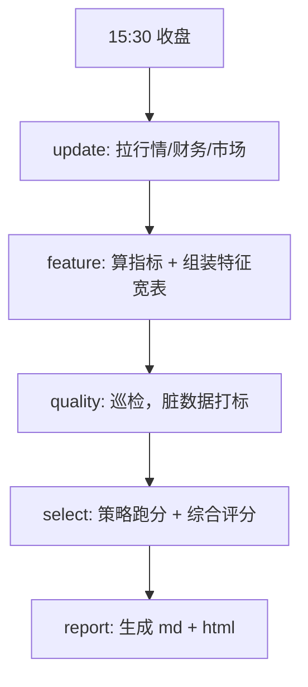

# 01 · 整体架构设计

## 定位

个人 A 股量化**分析**系统（不做交易），每日收盘后离线跑批：拉数 → 算指标 → 跑策略 → 出日报。可选做回测。

## 6 层架构（自下而上）

```
L6 交付层  report / (未来) FastAPI / LLM
L5 调度层  APScheduler jobs
L4 应用层  stock_selector / backtester
L3 策略层  BaseStrategy + 子类 + scoring
L2 特征层  indicators / feature_store / market_features / data_quality
L1 数据层  provider(akshare) + repository(DB)
L0 基础层  config / infra(db, logger, cache, calendar, code_hash)
```

**依赖方向严格自下而上**，下层永远不感知上层。

## 关键设计决策

| # | 决策 | 原因 |
|---|---|---|
| 1 | 策略输出「hit + reasons + sub_score」，综合评分统一由 `scoring.py` 汇总 | 避免每个策略各造评分口径 |
| 2 | 评分权重（技术 40 / 资金 30 / 基本面 30）走 config，不硬编码 | 不同市场阶段合理权重不同 |
| 3 | Provider / Repository 严格分离 | 未来接 QMT / tushare 只加 provider 分支 |
| 4 | 特征表 `daily_feature` 是策略的**唯一输入** | 保证回测和实盘用同一份特征生成逻辑 |
| 5 | SQLite 默认，SQLAlchemy 抽象 | 单机部署零门槛，未来可无痛切 PG |
| 6 | 调度层薄，业务在 CLI | 手动 CLI 可完整复现调度器行为，调试友好 |

## 每日流水线



## 扩展点（每个都是「新增模块」而不是改现有）

| 未来需求 | 落点 | 动核心？ |
|---|---|---|
| 实时行情 | `data/realtime_provider.py` | 否 |
| QMT / 自动交易 | `execution/qmt_client.py` | 否 |
| ML 模型 | `models/`，输入 = 现有特征表 | 否 |
| 向量相似度 | `feature_store/vector.py` + FAISS/Chroma | 否 |
| LLM 分析 | `report/llm_analyst.py` | 否 |

## 目录结构（最终版）

```
quant_system/
├── config/          全局配置（可调参数集中）
├── infra/           基础设施：db / logger / cache / trading_calendar / code_hash / board
├── database/        ORM 模型 + migrations
├── data/            数据源 provider + repository + 更新编排
├── market/          市场域：index_provider / sentiment
├── indicators/      技术指标（手写）
├── feature_store/   特征商店：builder（未来加 reader）
├── data_quality/    数据质量巡检 + 过滤器
├── strategy/        策略（纯函数）+ scoring + selector
├── backtest/        回测引擎
├── report/          日报生成
├── scheduler/       APScheduler 任务
├── cli.py           CLI 入口（Typer）
└── main.py          调度器常驻入口
```
