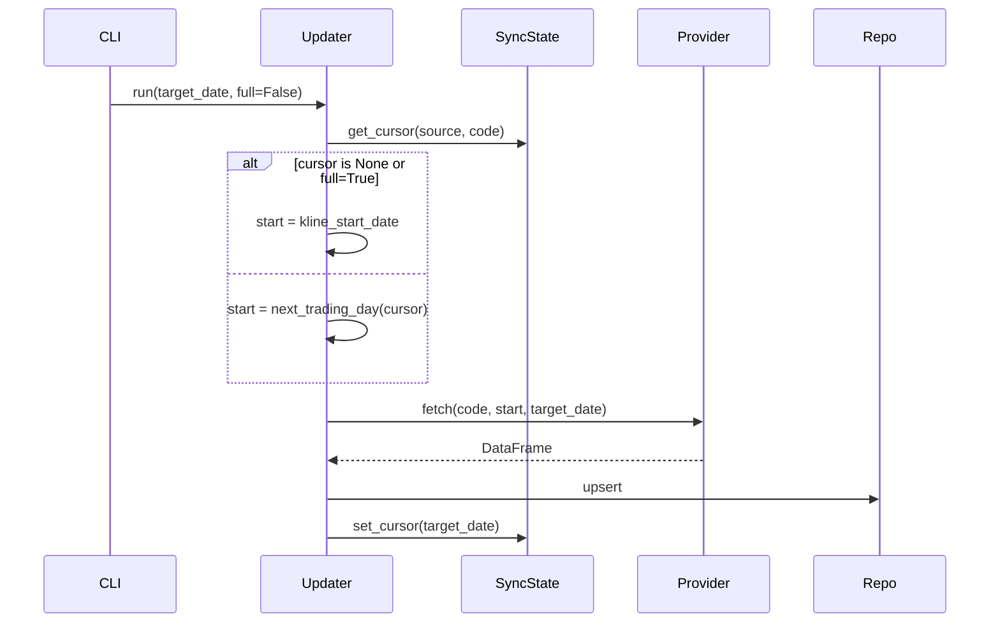

# 05 · 数据层：Provider / Repository / DataUpdate

## 三层职责

```
Provider    只管「从外部拿数据 + 转成规范列名 DataFrame」，不碰 DB
Repository  只管「DB 读写」，不碰外部数据源
DataUpdate  编排：provider 拉 → 去重 → repository 写 + 游标记录
```

**硬约束**：除 data_update / migrations 外，任何模块访问 DB 必须走 `data/repository.py`（R4）。

## Provider 抽象契约

```python
@runtime_checkable
class StockProvider(Protocol):
    name: str
    def fetch_stock_basic(self, force_refresh=False) -> pd.DataFrame: ...
    def fetch_daily_kline(self, code, start, end, adjust='none', force_refresh=False) -> pd.DataFrame: ...
    def fetch_pool_members(self, pool_code, force_refresh=False) -> pd.DataFrame: ...

# 同类 Protocol：FinancialProvider / IndexProvider / SentimentProvider
```

**规范列名固定**，业务层不感知 akshare 中文列名。

## akshare 实际接入

| 数据 | akshare 函数 | 备注 |
|---|---|---|
| 股票基础 | `stock_info_a_code_name` + `stock_zh_a_spot_em` | 前者稳定，后者补市值/换手率 |
| HS300 成分 | `index_stock_cons_sina(symbol="000300")` | sina 稳定过 csindex |
| ZZ500 成分 | `index_stock_cons_sina(symbol="000905")` | |
| 日线 | `stock_zh_a_hist(adjust="")` + `stock_zh_a_hist(adjust="hfq")` | 拉两次算 adj_factor |
| 财务 | `stock_financial_abstract_ths(indicator="按报告期")` | 同花顺比东财稳定 |
| 日频 PE/PB | `stock_a_indicator_lg` | 乐咕 |
| 指数日线 | `stock_zh_index_daily` | |
| 涨跌停快照 | `stock_market_activity_legu` | 只有当日 |
| 涨停池按日 | `stock_zt_pool_em(date)` | 历史回填用 |

**踩坑**：
1. sina HS300 成分含已退市股票（如 601989 中国重工）→ `replace_pool_members` 加了 FK 前置过滤
2. 东财 API 网络抖动频繁 → tenacity 3 次指数退避 + 优雅降级（补充数据失败不阻塞主表）

## 统一缓存层（本轮核心成果）

**原则**：Provider **禁止**自己写缓存，所有外部调用走 `infra/cache.cached_call()`。

### 分层策略

```python
class CachePolicy:
    @classmethod
    def historical(cls): return cls(ttl=None)          # 永久
    @classmethod
    def recent(cls):     return cls(ttl=3600)           # 1 小时
    @classmethod
    def realtime(cls):   return cls(ttl=0, enabled=False)  # 不缓存

    @classmethod
    def for_date(cls, target_date, today=None):
        """按日期自动选择：today→realtime；近 30 天→recent；否则→historical"""
```

### 统一入口

```python
def cached_call(key_parts, fn, policy=None, namespace="akshare", force_refresh=False):
    """所有 Provider 拉数据都通过它。"""
```

### CacheBackend Protocol

```python
class CacheBackend(Protocol):
    def get(key) -> Any | None: ...
    def set(key, value, ttl=None): ...
    def delete(key) -> bool: ...
    def clear() -> int: ...

# 当前实现：DiskCacheBackend（diskcache）
# 未来可加：RedisCacheBackend / MemcachedCacheBackend
```

## Repository 层

```python
@dataclass(frozen=True)
class Repositories:
    stock, kline, financial, feature, market, sync_state, job_log, quality

def build_repositories(session: Session) -> Repositories:
    return Repositories(
        stock=SQLAStockRepository(session),
        ...
    )
```

### 关键方法

- **`upsert_*`** 系列：SQLite 方言 `INSERT ... ON CONFLICT DO UPDATE`（PG 走通用 fallback）
- **`read_kline(code, start, end, adj)`**：读取层动态复权
  - `none` 原始价
  - `qfq` 前复权（以最新价为基准）
  - `hfq` 后复权（乘 adj_factor）
- **`replace_pool_members(pool, codes, as_of)`**：时间序列成分股同步（新增/剔除按 in_date/out_date 追踪）
- **`get_cursor(source, entity_key)`** / **`set_cursor(...)`**：增量同步游标

## DataUpdate 编排（6 个 Updater）

| Updater | 数据 | 游标粒度 |
|---|---|---|
| StockBasicUpdater | stock_basic | `_GLOBAL_` |
| StockPoolUpdater | stock_pool_member | `_GLOBAL_` per pool |
| KlineUpdater | daily_kline | 每只股票 |
| FinancialUpdater | financial_snapshot | 每只股票 |
| MarketUpdater | index_daily + market_daily | 每个指数独立 + 全局 |

### 增量同步流程



**幂等性**：同一天重跑 → `cursor >= target_date` 直接 skip；网络中断 → 从上次断点续传。

### JobLog 生命周期

每个 Updater 都被 `_wrap_job()` 包裹：
```
start_job(RUNNING) → fn() → finish_job(SUCCESS/FAILED, stats=stats.to_dict())
```

## CLI update 子命令组

```
qs update stock-basic       [--date --full]
qs update stock-pool        [--date --full --pool]
qs update kline             [--date --full --pool --codes --dry-run]
qs update financial         [--date --full --pool --codes]
qs update market            [--date --full --backfill]
qs update all               [--date --full]
```

`qs update all` 编排顺序：**basic → pool → kline → financial → market**（依赖顺序不可打乱）。

## 冒烟结果（当时）

- ✅ `qs update stock-basic` → 5528 只入库
- ✅ `qs update stock-pool` → HS300 池 298 只（2 只已退市自动跳过）
- ⏳ `qs update kline` → 代码链路完整，东财 API 当时网络抖动（tenacity 重试后优雅降级）
