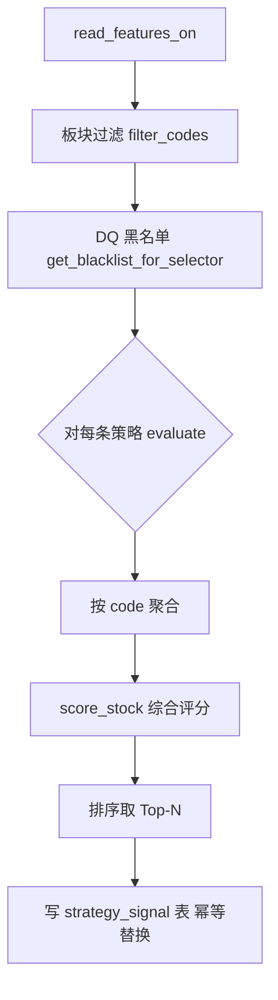

# 07 · 策略 + 评分 + 日报

## 分层职责

```
strategy/*.py            纯函数策略（不查 DB，不判 quality）
  ├── base_strategy      抽象基类 + StrategyResult dataclass
  ├── breakout_strategy  20 日突破
  ├── momentum_strategy  均线多头 + MACD 金叉
  ├── value_growth_strategy  低估成长
  ├── scoring            综合评分器（技术 40 + 资金 30 + 基本面 30 + 多命中加成）
  └── stock_selector     编排（板块过滤→DQ 黑名单→策略→评分→写库）

report/
  ├── charts.py          plotly 迷你 K 线（红涨绿跌）
  └── daily_report.py    md + html 双输出，同时落 daily_report/_item 表
```

**硬约束**：
- 策略层零 IO。输入 `pd.DataFrame`，输出 `list[StrategyResult]`。
- 板块过滤 + DQ 黑名单 + 写库 全部在 selector，策略永远拿到干净数据。
- 评分权重从 config 读，不硬编码。

## StrategyResult 数据结构

```python
@dataclass
class StrategyResult:
    code: str
    strategy_code: str
    signal_type: str = "HIT"      # HIT / WATCH / NEAR_MISS / FILTERED
    sub_score: float = 0.0        # 0-100 该策略维度得分
    reasons: list[str]
    filter_reason: str | None
    near_miss_gap: float | None
    category: str = "technical"   # technical / momentum / value（评分器分类用）
```

## 三个策略触发规则

| 策略 | HIT 条件 | 子分范围 |
|---|---|---|
| BREAKOUT_20D | 突破 20 日新高 + 量比 ≥1.5 + close>MA20 | 80~100（量比越大越高） |
| MOMENTUM_MA | 多头排列 + MACD 金叉 + 20 日涨幅 ≥5% | 80~95（20 日涨幅越大越高） |
| VALUE_GROWTH | PE∈[0,30] + ROE≥12 + 净利润同比>0 + 营收同比>0 | 75~95（ROE 越高越高） |

**WATCH 语义**：满足 2/3（或 3/4）主条件，子分给中等偏低（55-60），可选写入库。

## 综合评分算法

```
final_score = tech(40) + capital(30) + fundamental(30) + multi_hit_bonus(≤15)
```

- **技术面 40**：technical + momentum 类策略取最高子分 / 100 * 40
- **资金面 30**：从特征直接算（量比 + 换手率 + 换手率变化）
- **基本面 30**：优先用 value 策略结果；没触发则用 ROE + 利润增速兜底
- **多命中加成**：每额外命中一策略 +5，封顶 +15

**评分权重从 config.scoring 读**：`weight_technical=40 / weight_capital=30 / weight_fundamental=30`。

## Selector 编排流程



**幂等**：写入 signal 前先 `DELETE WHERE trade_date=today`，防止重跑重复。

## Signal 记录级别

配置 `QS_SIGNAL__RECORD_LEVEL`：
- `HIT_ONLY`：只记 HIT
- `HIT_FILTERED`：HIT + FILTERED（**默认**）
- `WITH_WATCH`：+ WATCH
- `ALL`：全记（含 NEAR_MISS）

Selector 在写库时根据 level 过滤，业务代码零改动。

## Report 生成

### Markdown
纯文本，含：概览 / 策略命中分布 / TopN 推荐（评分 + 分维度 + 理由 + 命中策略）/ 数据质量摘要 / 免责。

### HTML
- 内嵌 CSS，无外部依赖（plotly.js 通过 CDN 加载）
- 每只推荐股票一张卡片：#N 股票名·代码 · 大红色评分数字 · 命中策略 tag · 理由 li · 60 日 K 线（红涨绿跌 + MA20）
- 页面尾部数据质量摘要 + 免责

### 落表
- `daily_report`：每日一行（含 md_path / html_path / summary）
- `daily_report_item`：每条推荐一行（含分维度评分 + 命中策略 + 理由 JSON）

## CLI 新增

```
qs select [--date --top-n]     跑策略 + 评分 + 写库
qs report [--date --format]    生成 md/html 日报（前置自动跑 select）
qs pipeline [--date --skip-update]  端到端 5 步全跑
```

## 冒烟结果

- ✅ mock 20 只 → 板块过滤剔 300347.SZ → 19 只
- ✅ BREAKOUT_20D: 002050.SZ 命中（量比 1.68）
- ✅ MOMENTUM_MA: 600019.SH 命中（多头 + 金叉 + 6.14%）
- ✅ VALUE_GROWTH: 0（mock 数据无财报）
- ✅ 综合评分：600019 → 51.28（技 32.27 + 资 19.01 + 基 0）
- ✅ HTML 日报 29KB，含 2 个 K 线 chart div，plotly CDN 加载
- ✅ Markdown 日报格式工整，股票中文名（宝钢股份 / 三花智控）自动补齐
- ✅ 全流水线 `pipeline` 5 步全跑，日报入库 + 落文件

## 未来才做（保留接口）

- 定时推送日报到微信/邮件 → `scheduler/jobs.py`
- LLM 分析每只推荐 → `report/llm_analyst.py`
- 组合优化（推荐股票 → 建议权重）→ `execution/` 层
- 实盘胜率反馈 → `strategy_performance` 表滚动更新（第 8 步一起做）
