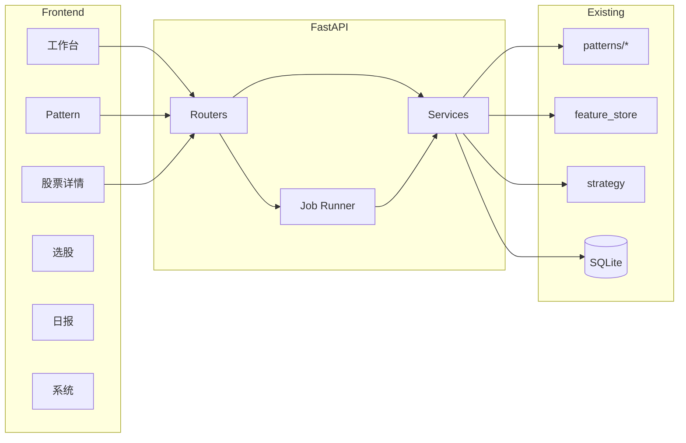

# 11 · Web Console（前端控制台 + HTTP API）

> 状态：📝 设计稿 v1（待评审）  
> 依赖：1 架构 / 5 数据层 / 6 特征 / 7 策略日报 / 9 关系层 / 10 Pattern Matching  
> 定位：用浏览器操作现有 `qs` 能力；**本阶段不支持前端改 Pattern/策略参数**，只读结果 + 触发已有批处理。

---

## 0. 一句话目标

在现有 CLI / Service 之上加一层 **HTTP API + SPA**，让用户用页面完成：

- 看 Pattern 扫描榜单 / 单票 eval / 命中明细  
- 看股票详情（K 线 + 指标叠加 + 基本面/特征摘要）  
- 看选股信号、日报、关系、数据质量与任务状态  

**不做**：前端在线编辑 Definition 参数、实盘交易、实时推送行情。

---

## 1. 范围与非目标

### 1.1 V1 必做（P0）

| 能力 | 对应现有 CLI / 模块 | 页面 |
|------|---------------------|------|
| Pattern 榜单 / 统计 | `qs abnormal top/stats/show` | Pattern 工作台 |
| 单票现场评估 | `qs abnormal eval` | Pattern 工作台 + 详情页入口 |
| 触发扫描（可选 force） | `qs abnormal scan` | Pattern 工作台 |
| 股票详情：K 线 + 指标 | kline + daily_feature | `/stocks/:code` |
| 股票搜索跳转 | stock_basic | 全局搜索 → 详情 |
| 选股结果 / 信号 | `qs select` 落库信号 | 选股页 |
| 日报列表与查看 | `reports/*.html` 或 DB | 日报页 |
| 系统健康 | `qs doctor` 部分信息 | 系统页 |

### 1.2 V1.1（P1，骨架预留）

| 能力 | 说明 |
|------|------|
| 关系网络 | `qs relationship` 查询相关股票、lead-lag |
| 数据质量 | quality 巡检结果列表 |
| 批任务触发 | update / feature / pipeline（长任务 + 进度） |

### 1.3 明确不做（本阶段）

- 前端修改 `PatternDefinition` / TargetValue / 权重  
- 用户登录权限体系（单机个人工具，默认本机访问）  
- WebSocket 实时行情  
- 改写现有 Matcher / Feature 算法（API 只封装）

---

## 2. 总体架构

```text
Browser (React SPA)
        │  JSON/HTTP
        ▼
FastAPI  (quant_system/api/)
        │  复用现有 Service / Repository
        ▼
SQLite / 现有批处理逻辑
```

原则：

1. **业务逻辑不搬进 API**：API 只做参数校验、调用现有 `patterns.service` / `matcher` / repos、DTO 序列化。  
2. **CLI 与 API 共用同一套 Service**，避免两套口径。  
3. **长任务异步化**：scan / update / pipeline 走 Job，前端轮询状态；短查询同步返回。  
4. **前端无参数编辑**：Pattern 仍改 Python Definition + 重扫；页面只消费结果。



---

## 3. 前端信息架构

### 3.1 路由

| 路由 | 名称 | 职责 |
|------|------|------|
| `/` | 工作台 | 最近交易日摘要：Pattern 命中数、选股 Top、任务状态、快捷入口 |
| `/patterns` | Pattern 工作台 | 选日期 / Pattern → 榜单、统计、触发 scan、点进详情或 eval |
| `/patterns/eval` | 单票评估 | `code + date + pattern` → 现场 match 明细（窗口日期、特征 value/sim） |
| `/stocks/:code` | 股票详情 | K 线 + 指标 + 摘要 + 近期 Pattern/信号 |
| `/signals` | 选股信号 | 按日查看策略命中与评分 |
| `/reports` | 日报 | 列表 + 内嵌/新开 HTML |
| `/relationships` | 关系（P1） | 相关股票、窗口 |
| `/system` | 系统 | doctor 摘要、最近 job、数据覆盖日期 |

全局：**顶栏搜索股票代码/名称** → 跳转 `/stocks/:code`。

### 3.2 股票详情页（核心页）

目标：从榜单 / 信号 / 搜索任意跳入后，一眼看完「这只票发生了什么」。

**布局（单栏主视觉 + 右侧摘要，桌面；移动端上下叠）**

```text
┌──────────────────────────────────────────────────────────┐
│ 001258.SZ 立新能源   行业/ST/上市日   [日期选择] [刷新]   │
├────────────────────────────────────────────┬─────────────┤
│                                            │ 报价摘要     │
│         K 线主图（全宽）                     │ 涨跌/量额   │
│         + MA / 成交量副图                    │ 一年价位分位 │
│         + 可选：Pattern 窗口高亮             │             │
│                                            ├─────────────┤
│         副图：MACD / RSI / 量比 等           │ 近期命中     │
│                                            │ Pattern/信号 │
├────────────────────────────────────────────┴─────────────┤
│ Tab：特征指标表 | 财务/估值摘要 | Pattern 评估 | 关系(P1)   │
└──────────────────────────────────────────────────────────┘
```

**图表要求**

| 图层 | 数据来源 | 说明 |
|------|----------|------|
| 蜡烛图 OHLCV | `daily_kline` | 默认近 120～250 根，可调 lookback |
| MA5/10/20/60 | `daily_feature` 或前端按 close 算 | 优先用库内特征，缺则前端算 |
| 成交量 | kline.volume | 副图 |
| MACD / RSI / 布林等 | `daily_feature` 已有字段 | 副图切换 |
| Pattern 窗口标注 | eval/show 的 `chosen_window_ranges` | 平台/突破区间背景带或标记 |

**交互**

- 日期切换：影响右侧「当日评估 / 信号」  
- 「用当前策略评估」按钮 → 调 `POST /api/patterns/eval`，结果展示在 Tab，并可高亮窗口到 K 线  
- 不提供改 Definition 的表单  

### 3.3 Pattern 工作台

```text
筛选：trade_date | pattern_id | limit
[扫描] [强制重扫]
────────────────────────────────────
统计卡片：命中数 / 宇宙 / 耗时
────────────────────────────────────
榜单表：rank | code | name | sim | windows(含日期) | 跳转详情 | 打开 eval
展开行：stage sim + 关键特征（或侧栏）
```

### 3.4 视觉与技术选型（前端）

| 项 | 选择 | 理由 |
|----|------|------|
| 框架 | React 18 + TypeScript + Vite | 与业界常见栈一致，图表生态好 |
| 路由 | React Router | |
| 请求 | TanStack Query | 缓存日期/code 查询 |
| UI | 轻量组件（如 Radix + 自研布局，或 Ant Design） | 工具台密度优先，避免营销风 |
| 图表 | Lightweight Charts 或 ECharts | K 线性能；指标叠加简单 |
| 样式 | 深色偏研究终端或浅色文档风二选一，**固定一套 CSS 变量** | 避免默认紫渐变模板感 |

V1 建议：**浅色工具风**（灰底、清晰表格、图表主区占视口），品牌名可用「Synapse Quant」或项目名 `quant_system` 作顶栏标识即可，不做落地页式 hero。

---

## 4. 后端设计（FastAPI）

### 4.1 目录

```text
quant_system/
├── api/
│   ├── app.py              # FastAPI factory
│   ├── deps.py             # session / repos 依赖注入
│   ├── schemas/            # Pydantic DTO
│   ├── routers/
│   │   ├── health.py
│   │   ├── stocks.py
│   │   ├── patterns.py
│   │   ├── signals.py
│   │   ├── reports.py
│   │   ├── relationships.py
│   │   ├── jobs.py
│   │   └── system.py
│   └── jobs/
│       └── runner.py       # 进程内后台任务（V1）
└── ...
web/                        # 前端工程（monorepo 子目录）
├── package.json
├── src/
│   ├── pages/
│   ├── components/
│   ├── api/
│   └── charts/
```

启动：

```bash
qs serve --host 127.0.0.1 --port 8000   # API + 可选挂载静态前端
# 或开发：uvicorn + vite proxy
```

### 4.2 API 一览（V1）

统一前缀 `/api`，JSON，时间 `YYYY-MM-DD`，代码 `000001.SZ`。

#### 健康 / 元数据

| Method | Path | 说明 |
|--------|------|------|
| GET | `/api/health` | DB 可连、版本 |
| GET | `/api/meta/trading-day` | 最近交易日、可选日历 |
| GET | `/api/meta/patterns` | 注册 Pattern 列表（id/name/version/threshold，**只读**） |

#### 股票

| Method | Path | 说明 |
|--------|------|------|
| GET | `/api/stocks/search?q=` | 代码/名称模糊，limit 20 |
| GET | `/api/stocks/{code}` | 基本信息（name/st/list_date/行业若有） |
| GET | `/api/stocks/{code}/kline?start=&end=&limit=` | OHLCV 序列 |
| GET | `/api/stocks/{code}/features?start=&end=` | daily_feature 序列（供指标图层） |
| GET | `/api/stocks/{code}/snapshot?date=` | 某日摘要：涨跌、量额、关键特征、价位分位 |

#### Pattern

| Method | Path | 说明 |
|--------|------|------|
| GET | `/api/patterns/{pattern_id}/top?date=&limit=` | 榜单（含 windows + ranges + 可选精简 metrics） |
| GET | `/api/patterns/stats?date=` | 各 pattern 命中统计 |
| GET | `/api/patterns/hits/{code}?date=` | 该股历史/当日命中（原 show） |
| POST | `/api/patterns/eval` | body: `{code, date, pattern_id}` → **当前 Definition 现场 match**（不落库） |
| POST | `/api/patterns/scan` | body: `{date, pattern_ids?, force?}` → 创建 job，返回 `job_id` |

`eval` 响应关键字段（与 CLI 对齐）：

```json
{
  "matched": true,
  "similarity": 78.5,
  "threshold": 70,
  "chosen_windows": {"platform": 10, "breakout": 1},
  "chosen_window_ranges": {
    "platform": {"start": "2026-07-01", "end": "2026-07-14", "length": 10},
    "breakout": {"start": "2026-07-15", "end": "2026-07-15", "length": 1}
  },
  "stage_similarity": {},
  "feature_similarity": {},
  "metrics": {"values": {}},
  "hard_failed": [],
  "reasons": []
}
```

#### 选股 / 日报

| Method | Path | 说明 |
|--------|------|------|
| GET | `/api/signals?date=&limit=` | 策略信号列表 |
| GET | `/api/reports` | 已生成日报日期列表 |
| GET | `/api/reports/{date}` | 返回 HTML 路径或内容 |

#### 任务

| Method | Path | 说明 |
|--------|------|------|
| GET | `/api/jobs/{job_id}` | 状态：PENDING/RUNNING/SUCCESS/FAILED + 进度/错误 |
| GET | `/api/jobs?limit=` | 最近任务 |

V1 Job 实现：**同进程 BackgroundTasks / 线程池**，状态存内存 + 可选写 `abnormal_run` / `job_log` 表。多 worker 以后再上队列。

#### 系统

| Method | Path | 说明 |
|--------|------|------|
| GET | `/api/system/doctor` | 表齐全性、最近 kline/feature 日期、池规模 |

### 4.3 错误约定

```json
{"error": {"code": "NOT_FOUND", "message": "无 K 线"}}
```

HTTP：400 参数 / 404 无数据 / 409 任务冲突（同日 scan 已在跑）/ 500 未捕获。

### 4.4 与现有表的映射

| API | 主数据 |
|-----|--------|
| kline | `daily_kline` |
| features | `daily_feature` |
| pattern top/hits | `abnormal_signal` + `score_components` |
| pattern eval | 内存调用 `GenericPatternMatcher`（读 kline） |
| pattern scan | `build_patterns` + `abnormal_run` |
| signals | `strategy_signal`（或现有选股落库表） |
| reports | `reports/` 文件或 report 元数据 |

**不新增业务表（V1）**；若 Job 状态需要持久化，优先复用 `job_log` / `abnormal_run`。

---

## 5. 页面 ↔ API 协作流

### 5.1 看某日 Pattern 榜 → 详情

```text
用户选 date
  → GET /api/patterns/RANGE_BREAKOUT/top?date=
  → 点 code
  → /stocks/001258.SZ?date=2026-07-15
  → GET kline + features + hits
  → （可选）POST eval 高亮窗口
```

### 5.2 直接评估未入库票

```text
/patterns/eval 输入 code+date
  → POST /api/patterns/eval
  → 展示 matched/hard_failed/特征表
  → 「查看 K 线」→ 详情页带 query 自动 eval 一次
```

### 5.3 触发扫描

```text
POST /api/patterns/scan {date, force}
  → job_id
  → 轮询 GET /api/jobs/{id}
  → SUCCESS 后刷新 top
```

---

## 6. 股票详情：指标清单（V1）

从 `daily_feature` 暴露到图表/表格（有则显示，无则隐藏）：

| 分组 | 字段（示例，以实际 ORM 为准） |
|------|------------------------------|
| 均线 | ma5/10/20/60、ma_bull_arrange、ma_position |
| 动量 | rsi、macd、macd_signal、macd_hist |
| 波动 | atr、boll 上下轨 |
| 量能 | volume_ratio、amount 相关 |
| 趋势/位置 | 若有 breakout 类特征则列出 |

K 线主图默认：蜡烛 + MA5/20/60 + 量。  
副图切换：MACD | RSI | 无。

Pattern 窗口高亮仅在「当日有 hits 或刚 eval」时绘制，颜色区分 platform / breakout。

---

## 7. 安全与部署

| 项 | V1 |
|----|-----|
| 绑定 | 默认 `127.0.0.1`，不暴露公网 |
| 鉴权 | 无；若需可加静态 Token Header（P1） |
| CORS | 开发期允许 Vite origin；生产同域静态托管 |
| 静态资源 | FastAPI `StaticFiles` 挂载 `web/dist` |

---

## 8. 交付阶段（实现顺序）

| 阶段 | 内容 | 验收 |
|------|------|------|
| **A. API 骨架** | health + stocks search/kline/features + patterns top/eval/hits | curl 跑通；与 CLI eval 数值一致 |
| **B. 前端骨架** | 布局、路由、搜索、Pattern 榜单页 | 能点进股票 |
| **C. 股票详情** | K 线 + MA/量 + 特征 Tab + 窗口高亮 | 从榜单跳转完整 |
| **D. Job scan** | 触发扫描 + 轮询 | 页面可重跑某日 Pattern |
| **E. 选股/日报/系统** | 只读页补齐 | 覆盖主要 CLI 只读能力 |
| **F. P1** | 关系页、pipeline 任务 | 按需 |

每阶段仍遵循：先小步实现 → 可演示 → 再下一段。

---

## 9. 关键决策（待你确认）

| # | 决策 | 建议默认 |
|---|------|----------|
| 1 | 前端目录 | 仓库根下 `web/`，与 Python 包分离 |
| 2 | 图表库 | **Lightweight Charts**（K 线）+ 简单表格展示特征 |
| 3 | 长任务 | V1 进程内 Job；不引入 Celery/Redis |
| 4 | 参数编辑 | **不做**；改 Definition 仍改代码 |
| 5 | Pattern 是否唯一首页重心 | V1 以 Pattern + 股票详情为主，选股/日报为二级导航 |
| 6 | 是否服务端算一套前端指标 | **否**，优先读 `daily_feature`；缺字段再前端用 close 补 MA |

---

## 10. 验收标准（V1 Done）

1. 本机打开页面，能选交易日看 `RANGE_BREAKOUT` TopN，列含窗口日期。  
2. 点击股票进入详情，看到 K 线、均线、成交量、至少 1 个副图指标。  
3. 详情或评估页可对当前 Definition `eval`，结果与 `qs abnormal eval` 一致（sim / hard_failed / 窗口日期）。  
4. 可触发 scan（force）并在完成后刷新榜单。  
5. 全局搜索可跳转任意有基本信息的股票。  
6. 不提供任何修改 Pattern 参数的 UI。

---

## 11. 开放问题

1. 日报是内嵌 HTML 还是只给文件链接？  
2. 选股表是否已稳定到可直接 API 化，还是先只做 Pattern + 详情？  
3. K 线复权：沿用库内口径（与 CLI 一致），是否要在详情标注「前复权/不复权」？

确认本设计后，建议从 **阶段 A（API 骨架）** 开始落地。
