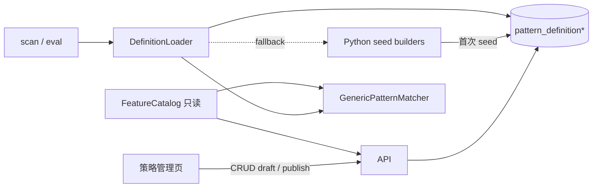

# 12 · Pattern Definition 可编辑存储 + 策略管理页

> 状态：✅ P0 已落地（可编辑存储 + 策略页 + 草稿调试）  
> 依赖：10 Pattern Matching / 11 Web Console  
> 目标：Definition 从「Python 写死」变为「可持久化、可前端编辑、扫描即时生效」；Matcher / Catalog 仍不改算法。

---

## 0. 一句话

**特征公式继续在代码 Catalog 里；模板参数（窗口、ideal/tolerance/weight、硬门槛、阈值）进 DB，前端「策略管理」编辑发布，scan/eval 只读已发布版本。**

---

## 1. 边界：什么可配，什么不可配

| 层 | 放哪 | 谁改 |
|----|------|------|
| 特征计算公式（slope / linearity / gap_open…） | `FeatureCatalog` Python | 开发者发版 |
| Stage 结构、窗口范围、Target、权重、threshold、constraints | **可编辑 Definition JSON** | 前端策略管理 |
| Matcher / Evaluator / 窗口枚举算法 | 代码 | 不改 |

原则：

1. **前端只能「选用」已注册特征名**，不能发明新公式。  
2. **不能在前端写 Python / 任意脚本**。  
3. 保存时服务端做 **schema 校验 + Catalog 存在性校验**，非法拒绝。  
4. 扫描结果必须能复现：落库带 `params_version`（已有）对应某次发布的 Definition 快照。

---

## 2. 存储方案（推荐）

### 2.1 为什么用 SQLite 表而不是只放文件

- 已有 SQLite 基建；版本、草稿、发布时间好查。  
- Web API 读写自然；CLI 也可读同一真相源。  
- 单机个人工具不需要对象存储。

可选补充：发布时同步 dump 一份 `data_cache/pattern_defs/{id}@{version}.json` 便于 git/diff（非必须）。

### 2.2 表设计（V1）

```text
pattern_definition
├─ id              TEXT PK          # RANGE_BREAKOUT
├─ display_name    TEXT
├─ description     TEXT
├─ status          TEXT             # draft | published | archived
├─ published_version TEXT NULL      # 当前线上版本号，如 tl-v2.6
├─ updated_at      DATETIME
└─ created_at      DATETIME

pattern_definition_revision
├─ id              INTEGER PK
├─ pattern_id      TEXT  FK
├─ version         TEXT             # 用户可见版本；同 pattern 内唯一
├─ body_json       TEXT             # 完整 Definition 序列化（见 §3）
├─ note            TEXT             # 变更说明
├─ created_at      DATETIME
├─ created_by      TEXT NULL        # 预留，V1 可固定 local
└─ UNIQUE(pattern_id, version)
```

加载规则：

```text
get_definitions()
  → 对每个 published 的 pattern_id
  → 取 published_version 对应 revision.body_json
  → deserialize → PatternDefinition
  → 若 DB 无任何 published：回退内置 seed（现有 Python builder）
```

### 2.3 与现有代码共存（迁移）

1. 保留 `build_range_breakout_definition()` 作为 **seed / 出厂默认**。  
2. 首次启动或 `qs pattern seed`：若 DB 无该 id，写入 draft+published 各一版（body=当前 Python 导出）。  
3. Registry 改为「DB published 优先，否则 seed」。  
4. 旧 `definitions/*.py` 不删，作种子与单测夹具。

---

## 3. JSON Schema（body 形态）

与现有 dataclass 一一对应，字段名稳定，便于前后端共用：

```json
{
  "id": "RANGE_BREAKOUT",
  "version": "tl-v2.6",
  "display_name": "横盘突破",
  "description": "...",
  "threshold": 70,
  "history_bars": 260,
  "stage_weights": { "platform": 0.4, "breakout": 0.6, "context": 0.1 },
  "timeline": [
    {
      "name": "platform",
      "window": { "min_length": 4, "max_length": 10 },
      "targets": {
        "amplitude": {
          "ideal": 0.08, "tolerance": 0.06, "weight": 0.18,
          "mode": "one_sided_low", "hard_max": 0.15
        }
      }
    }
  ],
  "relations": [
    {
      "name": "volume_vs_platform",
      "attach_to_stage": "breakout",
      "stage_map": { "platform": "platform", "breakout": "breakout" },
      "target": { "ideal": 1.7, "tolerance": 1.0, "weight": 0.5, "mode": "one_sided_high", "hard_min": 1.7 }
    }
  ],
  "context_features": [
    {
      "name": "price_position",
      "lookback_bars": 252,
      "target": { "ideal": 0.23, "tolerance": 0.2, "weight": 1.0, "mode": "one_sided_low", "hard_max": 0.23 }
    }
  ],
  "constraints": {
    "exclude_st": true,
    "min_list_days": 120,
    "min_amount": null,
    "min_market_cap": 50
  }
}
```

服务端：`body_json → PatternDefinition` 走同一校验（`__post_init__` + Catalog 名检查 + stage/relation 引用检查）。

---

## 4. 后端架构变更



### 4.1 新模块（建议）

```text
quant_system/patterns/
  serde.py          # Definition ↔ dict/JSON
  store.py          # load/save/publish/list revisions
  registry.py       # 改为走 store（缓存 + 失效）
```

### 4.2 API（V1）

| Method | Path | 说明 |
|--------|------|------|
| GET | `/api/patterns/definitions` | 列表（id/name/status/published_version） |
| GET | `/api/patterns/definitions/{id}` | 当前编辑态：draft 优先，否则 published |
| GET | `/api/patterns/definitions/{id}/revisions` | 版本历史 |
| GET | `/api/patterns/definitions/{id}/revisions/{version}` | 某版 body |
| PUT | `/api/patterns/definitions/{id}` | 保存 draft（body + 可选 version/note） |
| POST | `/api/patterns/definitions/{id}/publish` | draft → published（**version 自动 bump**，可选 note） |
| POST | `/api/patterns/definitions/{id}/eval-preview` | 用 **draft** 单票试跑（不落库） |
| POST | `/api/patterns/definitions/{id}/dry-scan` | 用 **draft** 全宇宙试扫（**不落库**，异步 Job，见 §5.6） |
| GET | `/api/patterns/definitions/{id}/dry-scan/{job_id}` | 试扫进度与结果（内存/临时表） |
| GET | `/api/meta/feature-catalog` | 可选用特征清单（name/group/doc/适用 stage\|relation\|context） |

正式扫描（落库）只认 published：

- `POST /api/patterns/scan` → **仅 published**；请求带 draft 直接 400  
- `POST /api/patterns/eval` → 默认 published；调试请走 `eval-preview` / `dry-scan`

### 4.3 缓存

进程内缓存 `published` Definition；`publish` / seed 时 `invalidate`。  
`--reload` 开发下无妨；多 worker 以后再上文件/信号失效（V1 单进程够用）。

---

## 5. 前端信息架构与交互

### 5.1 路由

| 路由 | 名称 |
|------|------|
| `/strategies` | 策略列表 |
| `/strategies/:id` | 策略编辑器（核心） |
| `/strategies/:id/history` | 版本历史（可嵌在编辑页抽屉） |

顶栏增加「策略」入口。

### 5.2 列表页 `/strategies`

- 卡片/表：名称、id、published 版本、更新时间、状态  
- 操作：编辑 / 扫描（跳 Pattern 工作台并带 pattern_id） / 复制为新草稿（V1.1）  
- V1 不做「从零新建任意 Pattern」：只管理已 seed 的 id（或「从模板克隆」V1.1）

### 5.3 编辑页布局（推荐三栏工具风，非营销页）

```text
┌─ 顶栏：名称 | 版本 | 草稿/已发布 | [保存草稿] [试跑] [发布] [回 Pattern] ─┐
├─ 左：结构树 ──────────┬─ 中：表单编辑 ──────────┬─ 右：说明/校验 ──────┤
│  基本信息              │  当前选中节点字段        │  特征说明（Catalog） │
│  硬约束                │  ideal/tol/weight/mode │  权重和校验提示      │
│  Stage: platform       │  hard_min/max          │  JSON 只读预览（可折叠）│
│    └ targets…          │  窗口 min/max           │                      │
│  Stage: breakout       │                        │                      │
│  Relations             │                        │                      │
│  Context               │                        │                      │
└────────────────────────┴────────────────────────┴──────────────────────┘
└─ 底栏可选：试跑区 code + date → 展示 matched/sim/hard_failed（调 eval-preview）
```

### 5.4 交互要点

1. **结构树点选 → 中栏编辑**，避免一屏堆 40 个特征。  
2. **数值用表单**（number + mode 下拉），不要默认让用户手写 JSON；高级用户可「导出/导入 JSON」。  
3. **添加特征**：弹层从 Catalog 多选（按 group 过滤：platform 可用 / relation 可用…）。  
4. **权重**：Stage 内 targets 权重实时求和；≠1 时警告但不强制（现 Python 也未强制=1）。  
5. **保存 ≠ 生效**：明确文案「保存草稿不影响扫描；发布后下次 scan 才用新版」。  
6. **发布前强制试跑可选**：至少展示校验通过；建议引导对 1～2 只熟悉票 `eval-preview`。  
7. **发布后**：toast + 提供「去扫描」按钮（`/patterns` 带 pattern）。  
8. **版本**：发布时 `version` 必填或自动 `tl-v{n}`；历史可「加载为草稿」（fork）。

### 5.5 不建议的交互

- 在 Pattern 工作台内联改参数（和「看榜」职责混）。  
- 富文本/可视化拖拽搭公式（成本高，收益低）。  
- 每个字段旁堆长说明（改用右侧 Catalog 文档 + 悬停短注）。  
- 用草稿直接点「正式扫描落库」（禁止；见 §5.6）。

### 5.6 草稿调试闭环（已拍板）

**规则**

- 版本号：**发布时自动 bump**（如 `tl-v2.5` → `tl-v2.6`；无数字后缀则补 `-1`）。  
- 草稿：**禁止**走正式 `scan` 入库；Pattern 工作台正式扫描只用 published。  
- 调试必须在策略页完成，且结果**可看、可点、不污染榜单表**。

**前端交互（策略编辑页底部 / 「调试」Tab）**

```text
┌─ 调试 ─────────────────────────────────────────────────────────┐
│ 模式：[ 单票试跑 ] [ 试扫榜单(不落库) ]                          │
│                                                                 │
│ 单票： code [________]  date [____]  [试跑]                     │
│   → matched / sim / threshold / hard_failed / 窗口 / 特征表      │
│   → [在 K 线页打开]（带 code+date，不带草稿入库）                │
│                                                                 │
│ 试扫： date [____]  limit TopN [50]  [开始试扫]                  │
│   → Job 进度条；完成后表格：rank / code / name / sim / 窗口      │
│   → 点 code → 用**同一草稿**再跑单票明细（或跳详情只看 K 线）    │
│   → 文案固定：「试扫结果仅本次有效，不会写入 abnormal_signal」   │
│                                                                 │
│ 对比（可选）：[同时跑 published] → 并排 sim / matched 差异高亮   │
└─────────────────────────────────────────────────────────────────┘
```

**两级调试分工**

| 方式 | 用途 | 是否落库 | API |
|------|------|----------|-----|
| 单票试跑 | 改参后秒级验证 hard_failed / 窗口 | 否 | `eval-preview` |
| 试扫榜单 | 看草稿在全市场大概打出谁、排序如何 | 否 | `dry-scan` Job |
| 正式扫描 | 发布后写入榜单，供工作台/历史 | **是** | 现有 `scan`（仅 published） |

**试扫结果存放**

- V1：进程内 Job（与现有 pattern scan Job 同类），`result.hits[]` 挂在 Job 上；刷新/重启丢失——可接受。  
- 不写 `abnormal_signal`；若需「保留试扫」留 P1 临时表。

**发布门闩（UX）**

- 「发布」按钮旁提示：建议至少完成 1 次单票试跑或 1 次试扫。  
- V1 **不强制**阻断发布（个人工具）；仅 warning。

---

## 6. 与「前端完成全部能力」的对齐

| 能力 | 现状 | 本阶段后 |
|------|------|----------|
| 改 Definition | 改 Python | 策略页编辑+发布 |
| 扫全市场（落库） | CLI / Pattern 页 | **仅 published** |
| 草稿调试 | 无 | 单票试跑 + 试扫榜单（不落库） |
| 看正式榜/详情/关联 | Web 已有 | 不变 |
| 拉数 / 关系 build | CLI | V1 仍可 CLI；V1.1 系统页挂按钮 |

「全部在前端」= **编辑 → 调试草稿 → 发布 → 正式扫描**；数据更新类长任务可后置。

---

## 7. 分阶段落地

### P0（建议本迭代）——含结构编辑

1. serde + DB 表 + seed 从现有 RANGE_BREAKOUT  
2. Loader 接 registry；scan/eval 走 published  
3. API：list/get/put draft/publish + feature-catalog  
4. 前端 `/strategies` + 编辑页：  
   - **阶段**：新增 / 重命名 / 删除 / 调序（受 Matcher 上限约束，见 §8）  
   - **阶段内指标**：从 Catalog 新增、编辑 Target、删除  
   - **Relation / Context**：同样可增删改  
   - 硬约束 / threshold / stage_weights  
5. 草稿调试：`eval-preview`（单票）+ `dry-scan` Job（试扫榜单，不落库）  
6. 发布时 **version 自动 bump**；正式 scan 拒绝 draft  

### P1

- 版本历史回滚为草稿  
- 从模板新建 Pattern（克隆结构，换 id）  
- Pattern 工作台显示「当前 published 版本」  
- 导入/导出 JSON  
- 试扫 vs published 并排对比  
- Stage 拖拽排序的更顺手交互  

### P2

- 试扫结果落临时表可回看  
- 发布审批/备注流（个人工具可跳过）  

---

## 8. 「结构可编辑」与「公式不可编辑」

此前草案里的「结构锁定」**已否决**（见下）。正确边界是：

| 可编辑（前端） | 不可编辑（仍在代码） |
|----------------|----------------------|
| 增删/改名/调序 Stage | 特征计算公式（Catalog） |
| Stage 窗口 min/max | Matcher 枚举与打分算法 |
| 增删改 Target（ideal/tol/weight/mode/hard） | 任意自定义脚本/公式 |
| 增删改 Relation / Context | 未注册到 Catalog 的「新指标名」 |
| threshold、stage_weights、constraints | — |

也就是说：**结构（有几个阶段、挂哪些指标）可以改；指标「怎么算」不能在前端发明。**

新增指标时：只能从 `GET /api/meta/feature-catalog` 里勾选已有特征（如 `slope`、`amplitude`），再填 Target 参数。

Matcher 现有约束（保存时校验，超限拒绝）：

- Timeline Stage **最多 3 个**（`PatternDefinition` 已有）  
- Stage 名唯一，且不能叫保留名 `context`  
- Relation 的 `attach_to_stage` / `stage_map` 必须指向已有 Stage  
- Relation / Context / Stage target 的 `name` 必须存在于 FeatureCatalog（或 relation/context 专用清单）  
- 删除 Stage 前：若仍有 Relation 引用，提示先改 Relation 或级联清理  

### 8.1 编辑器交互（结构编辑）

左树操作：

- Stage 旁 `[+ 阶段]`：弹出命名 + 默认窗口，插入 timeline  
- Stage 旁 `[↑][↓][删除]`：调序 / 删除（删前确认）  
- Stage 展开后 `[+ 指标]`：Catalog 多选 → 批量加入，默认给一套 Target 初值（ideal=0, tol=0.1, weight=0.1, mode=two_sided）  
- 指标行：点击进中栏编辑；行内 `[删除]`  
- Relations / Context 区块同样 `[+]` / `[删除]`

中栏：始终编辑「当前选中节点」；切树节点即切换表单，未保存草稿用本地 state，点「保存草稿」才 PUT。

### 8.2 已拍板决策

| # | 决策 | 结论 |
|---|------|------|
| A | 版本号 | **发布时自动 bump**（可附 note） |
| B | 草稿与正式 scan | **禁止草稿落库**；调试走 eval-preview / dry-scan |
| C | 结构编辑 | **允许**增删 Stage / 指标；公式只读 Catalog |
| D | 权重和 | V1 警告不阻断 |
| E | 单位文案 | 小数比例；市值亿元 |
| F | Stage 上限 | 维持 **≤3** |
| G | 草稿如何看结果 | 策略页：**单票试跑 + 试扫榜单（不落库）** |

---

## 9. 验收标准

1. 改参数后点发布（version 自动 +1），不改 Python，正式 `--force` scan 榜单变化。  
2. 保存草稿 / 试扫 **不写** `abnormal_signal`；Pattern 工作台榜单不变。  
3. 策略页单票试跑能展示 matched、sim、hard_failed、窗口、特征表。  
4. 策略页试扫能出 TopN 表，点击可看该票草稿明细。  
5. 对正式 `scan` 传入 draft 意图 → API 拒绝。  
6. 空库首次 seed 后行为与现网 RANGE_BREAKOUT 一致。  

---

## 10. 开放问题

1. ~~结构 / 版本 / 草稿 scan~~ → 已拍板（见 §8.2）  
2. **是否现在开工 P0 实现？**（回复「开始做」即可）  
