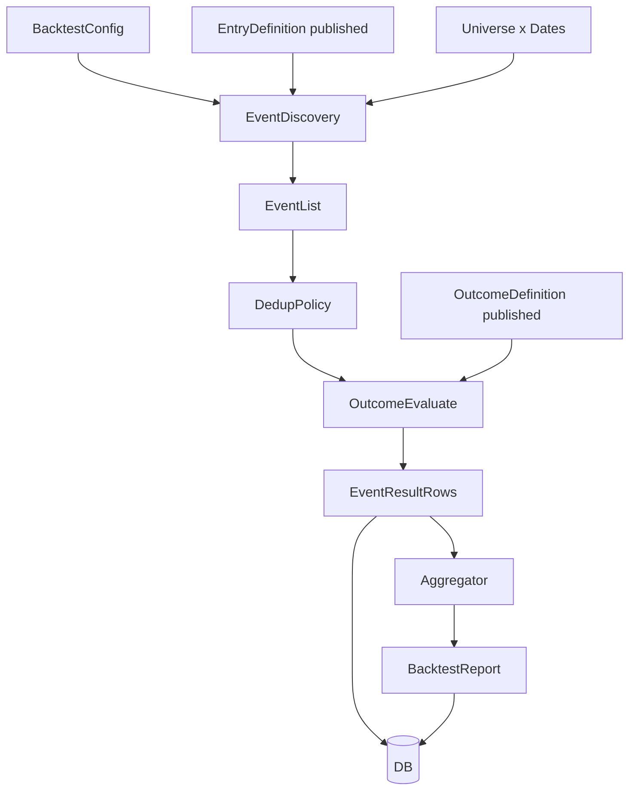

# 13 · Pattern 事件回测（Entry × Outcome）

> 状态：📝 设计稿 v1（待评审）  
> 依赖：10 Pattern Matching / 12 Pattern Definition Editor / 11 Web Console  
> 目标：在股票池 × 时间区间内，找出所有「入场形态命中」事件，用可配置的「验收/远期形态」评估后续走势，并聚合为策略效果报告。  
> 非目标：传统资金曲线组合回测（仓位/换仓/手续费）——已有 `backtest_task` 预留，本阶段不混用。

---

## 0. 一句话

**入场 Definition 负责「何时触发」；验收 Definition 负责「触发之后好不好」；两者共用 FeatureCatalog + Target 打分语义，但时间方向相反（入场向后看历史，验收向前看未来）。**

---

## 1. 问题定义与用户意图对齐

### 1.1 用户要什么

1. 选定一个已发布的 Pattern 策略（如横盘突破）。  
2. 选定股票宇宙（池 / 代码列表）与回测时间区间 `[start, end]`。  
3. 在区间内**逐日、逐票**跑入场匹配，收集全部命中时点（事件）。  
4. 对每个事件，用用户自定义的**验收策略**评估「之后一段时间」的表现（可多阶段、多指标、可打分）。  
5. 汇总得到：  
   - 策略综合效果分（需专门设计，不只是简单平均）  
   - 平均后 N 日涨跌、胜率、分位数、验收分分布等可解释指标  
   - 可下钻到单事件明细

### 1.2 与「组合回测」的本质区别

| 维度 | 本功能（事件回测 / Event Study） | 传统组合回测（后续阶段） |
|------|----------------------------------|--------------------------|
| 核心对象 | 信号事件 `(code, signal_date)` | 资金曲线 / 持仓序列 |
| 评价 | 触发后的路径质量、远期收益统计 | 年化、回撤、Sharpe、换手 |
| 仓位 | 不模拟 | 需要 |
| 重叠信号 | 需去重/衰减策略 | 由仓位约束消化 |
| 表 | 新建 `pattern_backtest_*` | 现有 `backtest_task/result` |

**本设计只做事件回测。** 不把结果硬塞进现有 `backtest_task`（字段语义是资金回测）。

### 1.3 成功标准（验收本功能本身）

1. 同一 Entry@version + Outcome@version + 宇宙 + 区间 → 结果可复现（落库带哈希）。  
2. 前端可编辑 Outcome（与 Entry 编辑器同构），发布后才能跑正式回测。  
3. 报告同时给出：**原始收益类指标** + **验收打分类指标** + **综合效果分**。  
4. 不引入未来函数：入场判定只用 `≤ signal_date` 的数据；验收窗口用 `> signal_date` 的数据。

---

## 2. 概念模型

```text
┌─────────────────────────────────────────────────────────────┐
│ Pattern Strategy Bundle                                     │
│  ├─ EntryDefinition   （现有 PatternDefinition）            │
│  │     在 asof=T 上向后切 timeline，score≥threshold → 事件    │
│  └─ OutcomeDefinition （新增，结构几乎相同）                 │
│        在 anchor=T 上向前切 timeline，产出 outcome_score 等  │
└─────────────────────────────────────────────────────────────┘
                              │
                              ▼
┌─────────────────────────────────────────────────────────────┐
│ Backtest Run                                                │
│  universe × [start,end] × Entry@version × Outcome@version │
│  → Events[] → Aggregate Report                              │
└─────────────────────────────────────────────────────────────┘
```

### 2.1 事件（Event）

一条事件最小字段：

| 字段 | 含义 |
|------|------|
| `code` | 股票 |
| `signal_date` | 入场命中日（asof） |
| `entry_similarity` | 入场总分 |
| `entry_windows` | 入场各 Stage 实际窗口 |
| `entry_hard_failed` | 应为空（命中才入库） |
| `outcome_*` | 验收侧结果（见 §5） |

锚点约定（**拍板默认**）：

- **Signal bar = 当日收盘后可知**。  
- 验收第 1 根可用 K：**下一交易日**（`T+1`）起算，避免用信号日收盘「假装未来」。  
- 可选高级项：`anchor_mode = next_open | same_close`（V1.1）；V1 固定 `next_open`（实现上用 T+1 日线 OHLC，收益用 close-to-close）。

### 2.2 Entry vs Outcome 的时间方向

```text
Entry（现有 Matcher）—— 向历史看：
  ... [platform][breakout] | T=signal_date
                           ↑ asof，窗口在左侧

Outcome（新 ForwardEvaluator）—— 向未来看：
  T=signal_date | [react][hold][settle] ...
                  ↑ 从 T+1 起向右切段
```

两者**共用**：

- `FeatureCatalog` 中的 stage/relation/context 公式  
- `TargetValue`（ideal / tolerance / weight / mode / hard_*）  
- Stage 加权 → overall similarity 的 Evaluator

Outcome **不共用**：

- 现有「从 asof 向左枚举窗口」的 `GenericPatternMatcher` 主循环  
- 需要新的 `ForwardWindowPlanner` + `ForwardOutcomeEvaluator`（见 §4）

---

## 3. OutcomeDefinition：验收策略怎么配

### 3.1 设计原则

用户直觉：「和入场一样，设几个阶段 + 指标 + 目标，然后打分。」  
因此 Outcome 的 JSON **刻意与 Entry 同构**，降低学习与编辑器成本。

差异仅在语义标签与校验规则：

| 字段 | Entry | Outcome |
|------|-------|---------|
| `timeline` | 入场前形态段 | 信号后远期段 |
| `window` | 在历史中枚举 min~max | **默认固定长度**（见下） |
| `threshold` | 命中门槛 | 验收「达标」门槛（用于胜率类统计） |
| `constraints` | 股票硬过滤 | 通常为空；可用「最少剩余交易日」 |
| `relations` | 跨入场段 | 跨远期段 |
| `context_features` | 信号日价位等 | 可选：相对信号日的位置等（需新 context 或 relation） |

### 3.2 窗口策略（关键决策）

远期窗口有两种建模：

| 模式 | 含义 | 优点 | 缺点 |
|------|------|------|------|
| A. **Fixed**（推荐 V1） | 每 Stage 固定 `length` 根（或 min=max） | 事件对齐、统计干净、实现简单 | 表达力略弱 |
| B. **Variable** | 与入场一样枚举 min~max 取最高分 | 与 Matcher 完全对称 | 远期「挑最好窗口」易乐观偏差 |

**拍板：V1 仅 Fixed**——Outcome 每个 Stage 要求 `min_length == max_length`（编辑器只暴露「天数」一个数）。  
V1.1 再考虑 Variable，并强制在报告中标注「optimistic window search」。

示例 Outcome（横盘突破后的「健康接力」）：

```json
{
  "id": "RANGE_BREAKOUT",
  "kind": "outcome",
  "version": "oc-v1.0",
  "display_name": "突破后 5+10 日健康表现",
  "threshold": 60,
  "stage_weights": { "react": 0.4, "hold": 0.6 },
  "timeline": [
    {
      "name": "react",
      "window": { "min_length": 3, "max_length": 3 },
      "targets": {
        "total_return": {
          "ideal": 0.04, "tolerance": 0.06, "weight": 0.5,
          "mode": "one_sided_high", "hard_min": -0.03
        },
        "max_drawdown_in_window": {
          "ideal": 0.02, "tolerance": 0.04, "weight": 0.5,
          "mode": "one_sided_low", "hard_max": 0.08
        }
      }
    },
    {
      "name": "hold",
      "window": { "min_length": 10, "max_length": 10 },
      "targets": {
        "total_return": {
          "ideal": 0.08, "tolerance": 0.10, "weight": 1.0,
          "mode": "one_sided_high"
        }
      }
    }
  ],
  "relations": [],
  "context_features": [],
  "metrics_extra": {
    "horizon_returns": [1, 3, 5, 10, 20],
    "benchmark": "000300.SH"
  }
}
```

### 3.3 必须新增的 Catalog 特征（Outcome 专用但通用）

现有 Catalog 大量是「段内几何/量能」，对远期够用；但事件研究还需要：

| name | kind | 说明 |
|------|------|------|
| `max_drawdown_in_window` | stage | 段内从高点到低点最大回撤（正数） |
| `mfe` | stage | Maximum Favorable Excursion：段内最高相对段首涨幅 |
| `mae` | stage | Maximum Adverse Excursion：段内最低相对段首跌幅 |
| `time_to_mfe` | stage | MFE 出现位置 ∈[0,1] |
| `close_vs_signal` | relation/context | 段末收盘相对信号日收盘涨跌 |
| `gap_vs_signal` | stage | 段首相对信号日的跳空（若 anchor=T+1） |

V1 **至少落地**：`max_drawdown_in_window`、`mfe`、`mae`、`total_return`（已有）。  
其余可 P1。

### 3.4 Outcome 与 Entry 的存储关系

在策略编辑器中，一个 `pattern_id` 对应：

```text
pattern_definition          # 已有：Entry 元数据
pattern_definition_revision # 已有：Entry 版本 body

pattern_outcome_definition          # 新增：Outcome 元数据（1:1 挂 pattern_id）
pattern_outcome_definition_revision # 新增：Outcome 版本 body
```

规则：

- Entry / Outcome **版本号独立**（`tl-v2.7` vs `oc-v1.0`）。  
- 正式回测必须同时锁定：`entry_version` + `outcome_version`。  
- 草稿 Outcome 可 `eval-preview` 单事件；正式回测 Job 只读 published Outcome（与 Entry 一致）。  
- 允许「有 Entry 暂无 Outcome」：此时回测只能跑 **纯收益统计模式**（无 outcome_score，见 §6.3）。

### 3.5 编辑器 UX（策略页扩展）

在 `/strategies/:id` 增加 Tab：

1. **入场形态**（现有）  
2. **验收形态**（新，复用结构树 + Catalog 选指标；窗口 UI 改为单数字「天数」）  
3. **回测**（新：宇宙/区间/参数 → 提交 Job → 看报告）

文案提示：

> 验收阶段从信号日**下一交易日**起算；指标公式与入场相同，但窗口在未来。

---

## 4. 算法设计

### 4.1 总体流水线



### 4.2 Event Discovery（入场扫描）

对每个 `code`，对区间内每个交易日 `T ∈ [start, end]`：

1. 构造 `PatternContext`（或按票缓存 K 线，避免每日全宇宙重建）。  
2. `GenericPatternMatcher.match(code, T, series, entry_def, ...)`  
3. 若 `matched` → 产生候选事件。

性能要点（必须设计，否则全市场 × 年无法用）：

| 手段 | 说明 |
|------|------|
| 按票加载 K 线一次 | `code → DataFrame`，日内切片 |
| 并发按票 | 复用 `PatternRunner` 的线程池思路，但改成「单票多日」 |
| 硬约束前置 | ST/上市天数/市值，日级可跳过 |
| 可选采样 | `asof_step`：每 N 日才评估（V1.1）；V1 默认每日 |
| 增量 | 同配置已跑过的区间可跳过（幂等键） |

复杂度粗估：  
`O(num_codes × num_days × entry_window_combinations)`。  
RANGE_BREAKOUT 类 2-stage 可变窗在全 A × 1 年可能很重 → **V1 默认宇宙建议池（HS300/自定义）**，全 A 需 `force` + 进度条。

### 4.3 去重策略（Dedup）——强烈影响统计

同一股票短时间多次命中会严重相关，简单平均会虚高样本。

**提供策略（配置项 `dedup_policy`）**：

| 策略 | 规则 | 默认 |
|------|------|------|
| `none` | 全留 | 否 |
| `cooldown` | 同票两次信号间隔 ≥ `cooldown_bars`（默认 = Outcome 总长度） | **是** |
| `best_in_cluster` | 冷却簇内只保留 entry_similarity 最高 | 可选 |
| `first_in_cluster` | 冷却簇内只保留最早 | 可选 |

报告中必须同时展示：

- `events_raw` / `events_used`  
- 使用的 dedup_policy  

### 4.4 Forward Outcome Evaluation

对事件 `(code, signal_date)`：

1. 取交易日历，令 `t0 = next_trading_day(signal_date)`。  
2. 按 Outcome.timeline 顺序，用固定长度切出各 Stage 的 `[start, end]` 索引（相对 `t0`）。  
3. 若任一 Stage 越出可用 K 线（停牌导致缺口：用交易日历对齐，缺 bar 则事件标记 `outcome_status=insufficient_data` 并排除出主统计，或进入「审查桶」）。  
4. 对每 Stage 调 Catalog `extract_stage`；Relation 用 stage_map；得到特征值。  
5. 走现有 Evaluator：Target → similarity → stage 加权 → `outcome_similarity`。  
6. `outcome_passed = outcome_similarity >= outcome.threshold`（且无 hard_failed）。  
7. 另算 **原始收益向量**（与打分独立，永远计算）：

```text
ret_n = close[T+n] / close[T] - 1    # n ∈ horizon_returns，T=signal_date
                                       # 缺数据则 NaN
benchmark_ret_n = bench_close[T+n] / bench_close[T] - 1
excess_n = ret_n - benchmark_ret_n
mfe_h, mae_h = 在 [T+1, T+h] 内相对 close[T] 的最大有利/不利偏移
```

**未来函数检查清单**：

- Entry 特征窗口 end ≤ signal_date  
- Outcome 特征窗口 start ≥ t0  
- 收益分母用 signal_date 收盘价（已知）  
- 宇宙成分：若用指数成分，应用 **当时成分**（P1）；V1 允许用「当前池成员 ∩ 当时已上市」近似，并在报告标注 `universe_mode=point_in_time_approx`

### 4.5 停牌 / 涨跌停 / 退市

| 情况 | V1 处理 |
|------|---------|
| 信号后无法凑满 Outcome 窗口 | `insufficient_data`，不进均值主样本 |
| 窗口内有停牌日 | 交易日对齐后自然缩短日历跨度；特征用可得 bar |
| 信号后 N 日内退市 | 收益算到最后可得收盘，标记 `censored=true` |
| 一字涨跌停导致无法买入 | V1 **不模拟可买性**；P1 加 `tradability` 过滤 |

---

## 5. 单事件产出（Event Result）

每条事件落库一份结构化结果（便于下钻与重聚合）：

```text
pattern_backtest_event
├─ run_id
├─ code / name
├─ signal_date
├─ entry_similarity / entry_distance
├─ entry_windows_json
├─ entry_feature_similarity_json
├─ entry_metrics_json
├─ outcome_status          # ok | insufficient_data | censored | error
├─ outcome_similarity
├─ outcome_passed          # bool
├─ outcome_hard_failed_json
├─ outcome_windows_json
├─ outcome_feature_similarity_json
├─ outcome_metrics_json
├─ returns_json            # { "1": 0.01, "5": 0.03, "20": -0.02, ... }
├─ excess_returns_json
├─ path_stats_json         # mfe/mae/time_to_mfe for key horizons
└─ dedup_kept              # bool
```

---

## 6. 聚合指标与「综合效果分」设计

这是本功能的价值核心：**不能只报一个平均数就结束**。

### 6.1 分层指标（报告固定结构）

#### A. 覆盖与样本质量

- `events_raw` / `events_used` / `events_insufficient`  
- `unique_codes`  
- `avg_events_per_code`  
- `date_span` / 信号时间分布（按月直方图）  
- `entry_similarity` 分布（mean/p25/p50/p75）

#### B. 原始收益（与 Outcome 打分无关，必出）

对每个 horizon `n ∈ {1,3,5,10,20,...}`：

| 指标 | 定义 |
|------|------|
| `avg_ret_n` | 均值 |
| `median_ret_n` | 中位数（抗极端） |
| `win_rate_n` | `ret_n > 0` 比例 |
| `p10_ret_n` / `p90_ret_n` | 分位 |
| `avg_excess_n` | 相对基准超额均值 |
| `profit_factor_n` | 平均盈利 / 平均亏损绝对值 |
| `avg_mfe_n` / `avg_mae_n` | 路径质量 |

#### C. 验收打分（Outcome）

- `avg_outcome_similarity` / `median_outcome_similarity`  
- `outcome_pass_rate`（≥ threshold 且未 hard fail）  
- `hard_fail_rate`  
- 各 Stage 平均 similarity  
- Top/Bottom 特征贡献（哪些 target 最常拖后腿）

#### D. 联合视角（Entry × Outcome）

- 分桶：按 `entry_similarity` 四分位，看各桶 `avg_ret_5` / `outcome_pass_rate`（高入场分是否对应更好远期？）  
- 散点摘要：Pearson(`entry_similarity`, `ret_5`) 等

### 6.2 综合效果分 `strategy_effect_score`（0–100）

**目标**：给一个可横向比较的标量，但**必须可解释、可拆解**，避免黑箱加权失控。

#### 推荐公式（V1 拍板草案）

先定义若干「子分」∈[0,100]，再加权：

```text
S_return   = 基于主 horizon（默认 n=10）的收益质量
S_risk     = 基于 MAE / 最大回撤 / 左尾（p10）的风险质量
S_outcome  = Outcome 验收通过率与平均分
S_stability= 跨年/跨月收益稳定性（低波动加分）
S_sample   = 样本充足度（事件数、覆盖股票数）

strategy_effect_score =
    0.35 * S_return
  + 0.20 * S_risk
  + 0.25 * S_outcome
  + 0.10 * S_stability
  + 0.10 * S_sample
```

#### 子分细则（可配置，写入 run 快照）

**S_return（主 horizon = `primary_horizon`，默认 10）**

```text
# 用「超额收益」优先于绝对收益，减少牛熊偏差
x = avg_excess_primary
# 映射：-10% → 0 分，0% → 50 分，+10% → 100 分（线性截断）
S_return = clamp(50 + 500 * x, 0, 100)   # 500 = 50/0.10
# 并用中位数修正极端：
S_return = 0.6 * map(avg_excess) + 0.4 * map(median_excess)
```

**S_risk**

```text
# avg_mae_primary 越小越好；10% MAE → 低分，2% → 高分
S_risk = clamp(100 * (1 - avg_mae_primary / 0.10), 0, 100)
# 结合 p10_ret：左尾越差越扣分
S_risk = 0.5 * S_mae + 0.5 * map_p10(p10_ret_primary)
```

**S_outcome**

```text
S_outcome = 0.5 * (100 * outcome_pass_rate)
          + 0.5 * avg_outcome_similarity
```

若未配置 Outcome：`S_outcome` 权重并入 `S_return`，或报告标注「无验收定义，综合分降级为收益-风险分」。

**S_stability**

```text
# 按自然月切片的 avg_ret_primary 的标准差 σ
# σ=0 → 100；σ=5% → 0（线性）
S_stability = clamp(100 * (1 - σ / 0.05), 0, 100)
```

**S_sample**

```text
# events_used: 30→50分，100→80分，300→100分（分段线性）
# unique_codes: 10→50分，50→80分，100→100分
S_sample = 0.5 * f_events + 0.5 * f_codes
```

#### 为什么不只「全部取平均」

| 做法 | 问题 |
|------|------|
| 只平均 `ret_n` | 牛市虚高；忽略回撤与通过率 |
| 只平均 `outcome_similarity` | 验收阈值主观，可能与真实赚钱脱节 |
| 只胜率 | 忽略盈亏比 |
| 本方案加权子分 | 可拆解；权重进快照可复现；前后端可展示贡献条 |

V1.1 可提供 2～3 套权重预设：`balanced` / `return_first` / `risk_first`。

### 6.3 无 Outcome 时的降级模式

仅 Entry + 收益统计：

- 仍出 §6.1 A/B  
- `strategy_effect_score` 使用 `return_first` 权重（Outcome 项为 null）  
- UI 提示配置验收形态以解锁完整评分

---

## 7. 数据模型

### 7.1 新表（推荐）

```text
pattern_outcome_definition
├─ pattern_id       TEXT PK  FK → pattern_definition.id
├─ display_name     TEXT
├─ description      TEXT
├─ status           TEXT     # draft | published
├─ published_version TEXT NULL
├─ created_at / updated_at

pattern_outcome_definition_revision
├─ id PK
├─ pattern_id
├─ version          TEXT     # oc-v1.0
├─ body_json        TEXT
├─ note / created_at / created_by
└─ UNIQUE(pattern_id, version)

pattern_backtest_run
├─ id PK
├─ pattern_id
├─ entry_version
├─ outcome_version     NULL  # 纯收益模式可空
├─ universe_type       # pool | codes
├─ universe_ref        # pool code 或 JSON codes hash
├─ start_date / end_date
├─ config_json         # dedup/horizons/benchmark/score_weights/primary_horizon...
├─ config_hash         # 幂等
├─ status              # PENDING/RUNNING/SUCCESS/FAILED/CANCELLED
├─ progress / message
├─ error_msg
├─ summary_json        # 聚合结果快照
├─ effect_score        # 冗余列便于排序
├─ events_raw / events_used
├─ created_at / started_at / finished_at
└─ INDEX(pattern_id, created_at), INDEX(status), UNIQUE(config_hash) 可选

pattern_backtest_event
├─ id PK
├─ run_id FK
├─ code / signal_date
├─ ...（见 §5）
└─ UNIQUE(run_id, code, signal_date)
   INDEX(run_id, outcome_passed), INDEX(run_id, signal_date)
```

### 7.2 与旧 `backtest_task` 的关系

- **不复用**为 Pattern 事件回测主表。  
- 文档层标注：未来「组合回测」继续用 `backtest_task/result`；本模块前缀 `pattern_backtest_*`。  
- CLI 占位 `qs backtest` 可拆为：  
  - `qs pattern-backtest ...`（本功能）  
  - `qs portfolio-backtest ...`（后置）

### 7.3 幂等与复现

`config_hash = sha1(pattern_id, entry_version, outcome_version, universe, dates, config_json)`  

- 同 hash 且 SUCCESS → 默认跳过（`--force` 重跑）  
- `summary_json` + 全部 event 行足够复现报告（无需重算）

---

## 8. 模块与代码布局

```text
quant_system/patterns/
  outcome/
    definition.py      # OutcomeDefinition（可 typedef = PatternDefinition + kind）
    serde.py           # 复用/薄封装 patterns.serde
    forward.py         # ForwardWindowPlanner + evaluate_outcome()
    metrics_path.py    # mfe/mae/drawdown/horizon returns
  backtest/
    config.py          # BacktestRunConfig dataclass
    discover.py        # EventDiscovery
    dedup.py
    aggregate.py       # 指标 + effect_score
    service.py         # run_pattern_backtest()
    store.py           # DB 读写

quant_system/api/
  routers/backtests.py
  tasks/runners.py     # 挂 task_id = pattern.backtest

web/src/pages/
  StrategyEditorPage   # + Outcome Tab
  StrategyBacktestPage # 或编辑器内 Tab「回测」
```

**Matcher 不修改算法**；只新增 Forward 路径。  
Catalog 追加 Outcome 常用特征。

---

## 9. API 设计

| Method | Path | 说明 |
|--------|------|------|
| GET/PUT | `/api/patterns/definitions/{id}/outcome` | 读/存 Outcome 草稿 |
| POST | `/api/patterns/definitions/{id}/outcome/publish` | 发布 Outcome（版本 bump `oc-v*`） |
| POST | `/api/patterns/definitions/{id}/outcome/eval-preview` | 单票单日：给定 signal_date，看验收明细 |
| POST | `/api/patterns/backtests` | 创建回测 Job |
| GET | `/api/patterns/backtests` | 历史 run 列表 |
| GET | `/api/patterns/backtests/{run_id}` | 汇总 + 配置 |
| GET | `/api/patterns/backtests/{run_id}/events` | 分页事件表（筛选 passed/ret） |
| GET | `/api/patterns/backtests/{run_id}/events/{event_id}` | 单事件明细 |

创建回测 body 示例：

```json
{
  "pattern_id": "RANGE_BREAKOUT",
  "entry_version": null,
  "outcome_version": null,
  "universe": { "type": "pool", "pool": "HS300" },
  "start_date": "2025-01-01",
  "end_date": "2026-07-16",
  "dedup_policy": "cooldown",
  "cooldown_bars": null,
  "horizon_returns": [1, 3, 5, 10, 20],
  "primary_horizon": 10,
  "benchmark": "000300.SH",
  "score_profile": "balanced",
  "force": false
}
```

`entry_version/outcome_version = null` → 用当前 published。

系统页 TaskCatalog 可增加 `pattern.backtest`（重任务，走 heavy 互斥）。

---

## 10. 前端信息架构

### 10.1 策略编辑 · 验收 Tab

- 复用 Entry 的结构树/表单，限制 Stage 窗口为固定天数。  
- 提供「从模板创建」：如「5 日反应 + 10 日持有」「纯 20 日收益验收」。  
- 调试：输入 code + signal_date → outcome eval-preview（K 线可画远期窗口色带）。

### 10.2 回测 Tab / 页

```text
┌ 配置 ─────────────────────────────────────────────┐
│ 宇宙 [池▼] [HS300]   区间 [from][to]              │
│ 去重 [cooldown▼]  主horizon [10]  基准 [沪深300] │
│ Entry版本 [published]  Outcome版本 [published]   │
│ [开始回测]                                        │
└───────────────────────────────────────────────────┘
┌ 综合 ─────────────────────────────────────────────┐
│ Effect Score  72.4    拆解条：收益/风险/验收/...   │
│ 事件 1280→914(dedup)  股票 186   PassRate 41%     │
└───────────────────────────────────────────────────┘
┌ 表：horizon 收益 | Outcome | 月度稳定性 ──────────┐
└───────────────────────────────────────────────────┘
┌ 事件表（可排序） code | date | entry | ret_5 | ... ┘
   点击 → 股票详情 + 窗口高亮 + 特征表
```

### 10.3 与 Pattern 工作台关系

- 工作台仍是「某日正式扫描榜」。  
- 回测是「历史区间效果研究」，入口在策略页，不塞进榜单页。

---

## 11. 偏差、陷阱与对策（设计必读）

| 陷阱 | 表现 | 对策 |
|------|------|------|
| 未来函数 | 验收用到信号日未可知数据 | 锚点 T+1；代码断言窗口 |
| 乐观窗口搜索 | Variable 远期挑最高分 | V1 Fixed only |
| 重复计数 | 连续命中虚增样本 | cooldown dedup |
| 牛熊偏差 | 绝对收益虚高/虚低 | 主看 excess；stability 子分 |
| 幸存者 | 用今日成分回测历史 | 标注；P1 用历史成分 |
| 数据缺口 | 停牌凑不满窗 | insufficient 桶，不进主均值 |
| 过拟合验收 | 对着历史调 Outcome 阈值 | 版本锁定；建议样本外分段（P1：walk-forward） |
| 算力爆炸 | 全 A × 每日 × 可变入场窗 | 默认池；进度 Job；缓存按票 |

### 11.1 样本外建议（P1）

同一配置支持 `train_end` / `test_start`：  
只在 test 段汇总主报告；train 段仅用于用户自己调参（UI 警告）。

---

## 12. 分阶段落地

### P0（可用闭环）

1. Outcome 表 + serde + 策略页验收 Tab（Fixed 窗口）  
2. Catalog：`max_drawdown_in_window` / `mfe` / `mae`  
3. `ForwardOutcomeEvaluator` + 单事件 preview  
4. Event Discovery（池宇宙）+ cooldown dedup  
5. 收益 horizons + Outcome 分 + effect_score  
6. `pattern_backtest_run/event` 落库 + API + 回测 Tab 报告  
7. heavy Job 接入系统任务互斥  

### P1

- 基准超额完善、月度稳定性图  
- Entry×Outcome 分桶分析  
- walk-forward 样本外  
- 历史成分股宇宙  
- Outcome Variable 窗口（带乐观偏差警告）  
- 事件导出 CSV  

### P2

- 与组合回测打通（事件 → 可选交易规则 → 资金曲线）  
- 多策略对比看板  
- 自动搜索 Outcome 阈值（谨慎，易过拟合）  

---

## 13. 与现有能力映射

| 现有 | 复用方式 |
|------|----------|
| `PatternDefinition` / serde / 编辑器 | Entry 不变；Outcome 同构 |
| `FeatureCatalog` + Evaluator | Outcome 打分 |
| `GenericPatternMatcher` | 仅 Event Discovery |
| `pattern_definition*` 表 | Entry |
| API Job runner + heavy 互斥 | 回测长任务 |
| `backtest_task/result` | **不占用**；留给组合回测 |
| 股票详情 K 线 | 事件下钻画窗口 |

---

## 14. 开放问题（需你拍板）

下列已在正文给推荐默认；评审时确认即可：

| # | 问题 | 推荐默认 |
|---|------|----------|
| 1 | 验收锚点 | `T+1` 起算（next bar） |
| 2 | Outcome 窗口 | Fixed（min=max） |
| 3 | 去重 | `cooldown`，默认冷却 = Outcome 总 bar 数 |
| 4 | 综合分主 horizon | 10 日超额收益 |
| 5 | 综合分权重 | balanced：35/20/25/10/10 |
| 6 | V1 宇宙 | 股票池，不做全 A 默认 |
| 7 | 无 Outcome 能否回测 | 能，降级为纯收益模式 |
| 8 | 是否修改旧 `qs backtest` | 新增 `pattern-backtest`，旧命令暂留 TODO |

---

## 15. 评审通过后的实现顺序（给下一阶段）

1. 设计冻结 §14 默认值  
2. DB migration + Outcome store  
3. Forward evaluator + path metrics  
4. Discovery + aggregate  
5. API  
6. 前端验收 Tab + 回测 Tab  
7. 用 RANGE_BREAKOUT + 小池小区间做金样例（固定 seed 日期，断言事件数与均收益稳定）

---

## 16. 附录：术语表

| 术语 | 含义 |
|------|------|
| Entry | 入场形态定义（现有 Pattern） |
| Outcome / 验收 | 信号后的远期评估定义 |
| Event | 一次入场命中 `(code, signal_date)` |
| Horizon | 信号后第 n 个交易日的收益观察点 |
| Effect Score | 综合效果分 `strategy_effect_score` |
| Dedup | 事件去重，降低重复计数偏差 |
| MFE / MAE | 最大有利/不利偏移 |
