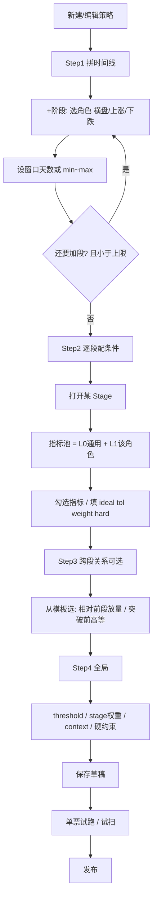

# 14 · 角色 Stage + 分层指标体系（引导式形态拼装）

> 状态：✅ P0 已落地（引导编辑 + Catalog 分层；策略仍仅 RANGE_BREAKOUT）  
> 依赖：10 Pattern Matching / 12 Definition Editor  
> 关联：13 事件回测（Entry/Outcome 均可套用同一套角色语言）  
> 目标：用「横盘 / 上涨 / 下跌」三种过程角色拼时间序列；指标按「通用段内指标」与「角色专用指标」分层；编辑更引导、仍可落到现有 Matcher。

---

## 0. 一句话

**行情路径 = 若干「过程段」的有序拼接；过程只有三种角色（横盘 / 上涨 / 下跌）。每段选窗口 + 从该角色可用的指标池勾条件；跨段关系单独配置。公式仍在 Catalog，前端不写脚本。**

---

## 1. 问题与动机

### 1.1 现状痛点

| 现状 | 问题 |
|------|------|
| Stage 名自由（`platform`/`breakout`） | 无统一语义，难教、难复用模板 |
| Catalog 按 price/volume/trend 分类 | 这是**计算分类**，不是「这段在干什么」 |
| 任意指标可挂任意 Stage | 上涨段挂「横盘缩量」也能保存，易配错 |
| 指标列表扁平 | 用户不知道先选什么 |

### 1.2 用户命题（本设计采纳）

1. 股票局部过程可抽象为：**横盘、上涨、下跌**（足够描述绝大多数可交易序列）。  
2. **只加 Stage（带角色）** 就能描述「跌→横→涨」「涨→横→再涨」等组合。  
3. 每个 Stage 都能用一批**只依赖本段序列**的通用指标。  
4. 上涨/下跌另有一批**角色定制指标**（连续涨天数、涨速加快/变缓等）。  
5. 仍保持：指标公式代码化；参数（ideal/tol/hard）可配置。

### 1.3 非目标

- 不用 ML 自动识别段角色。  
- 不在前端发明公式。  
- 不取消高级自由模式（见 §9）；V1 默认引导模式。  
- 不把 Relation/Context 硬塞进「三角色」——它们是另一层。

---

## 2. 核心概念

### 2.1 Stage Role（过程角色）

```text
StageRole = range | up | down
           （横盘） （上涨） （下跌）
```

| 角色 | 用户语义 | 典型期望（可被指标+阈值表达，不是硬编码） |
|------|----------|------------------------------------------|
| `range` | 震荡整理、箱体、筹码交换 | 振幅有限、斜率近 0、路径较直、后段缩量… |
| `up` | 上涨推动、突破段、接力 | 收益为正、阳线多、连续上涨、加速/不滞涨… |
| `down` | 下跌、砸盘、回调段 | 收益为负、阴线多、连续下跌、跌速… |

**允许角色重复**：`range → up → range` 合法。  
**顺序自由**：由用户排列 Stage 列表决定时间顺序（入场向左看历史；验收向右看未来，见 13）。

### 2.2 与现有 Stage 的映射

运行时仍是现在的 `Stage(name, window, targets)`，只是多带元数据：

```text
Stage
├─ name          # 机器名：自动生成 range_1 / up_1 / down_2，或用户改
├─ role          # 新增：range | up | down   ★
├─ window        # min/max（或引导模式先固定 length）
└─ targets{}     # 指标名 → TargetValue（不变）
```

JSON 示例：

```json
{
  "name": "range_1",
  "role": "range",
  "window": { "min_length": 5, "max_length": 10 },
  "targets": {
    "amplitude": { "ideal": 0.08, "tolerance": 0.06, "weight": 0.3, "mode": "one_sided_low", "hard_max": 0.15 },
    "slope": { "ideal": 0.0, "tolerance": 0.01, "weight": 0.3, "mode": "two_sided", "hard_min": -0.01, "hard_max": 0.005 }
  }
}
```

Matcher **可以不读 role**（打分仍只看 targets）；role 用于：

1. 编辑器过滤可选指标  
2. 校验「该指标是否允许挂在此角色」  
3. 模板/默认 Target 推荐  
4. UI 展示与文档

### 2.3 拼装自由度（回答「是否描述所有序列」）

在 **≤N 段**（建议仍 ≤3，与 Matcher V1 一致；P1 可评估放宽到 4～5）约束下：

```text
序列 ≈ role_1(w1) → role_2(w2) → role_3(w3)
```

可表达例如：

| 序列 | 角色链 |
|------|--------|
| 横盘突破 | `range → up` |
| 下跌后横盘再涨 | `down → range → up` |
| 冲高回落 | `up → down` |
| 下跌中继 | `down → range → down` |
| 验收：涨后稳住 | Outcome: `up → range` |

不能优雅表达、需 Relation/Context 补的：

- 「突破站上前高」（跨段价位）→ Relation  
- 「一年分位够低」（长历史）→ Context  
- 「相对前一段放量」→ Relation  

因此完整模型是：

```text
Timeline(角色 Stage 有序表) + Relations(跨段) + Context(股票级) + threshold/weights/constraints
```

---

## 3. 指标分层体系（本设计重点）

### 3.1 三层分类

```text
FeatureCatalog 每个 stage 指标增加：
  roles: set[StageRole] | "all"     # 哪些角色可选
  tier:  universal | role_specific  # 通用 vs 角色专用
  group_ui: price | volume | path | quality | ...  # 编辑器二级分组
```

| 层 | 代号 | 含义 | 出现位置 |
|----|------|------|----------|
| L0 通用段内 | `universal` | **只依赖本段 OHLCV 序列**即可算；三角色都可挂 | 所有角色指标池顶部 |
| L1 角色专用 | `role_specific` | 语义绑定涨/跌/横盘；仍只算本段，但默认只在对应角色展示 | 对应角色池 |
| L2 跨段/全局 | `relation` / `context` | 不进「单段指标池」 | 单独区块 |

**原则**：L0/L1 的 `extract_stage(df_segment)` 签名不变；角色只影响**推荐与校验**，不改变计算公式。

### 3.2 L0 通用段内指标（任何一段都能用）

> 「只要是一段序列就能算」——与角色无关的几何 / 量能 / K 线质量。

#### 价格与路径

| name | 含义（给用户的一句话） | 单位/范围 | 现有 |
|------|------------------------|-----------|------|
| `total_return` | 这段整体涨跌幅 | 比例 | ✅ |
| `slope` | 价格漂移斜率（抬升/下倾多猛） | 相对均价 | ✅ |
| `linearity` | 走得像不像一条直线 | 约 0～1 | ✅ |
| `amplitude` | 段内高低振幅 | 比例 | ✅ |
| `volatility` | 日收益波动 | 标准差 | ✅ |
| `close_vs_window_high` | 收盘相对段内最高的回撤 | 比例≤0 | ✅ |
| `peak_day` | 最高价出现在段的前/中/后 | 0～1 | ✅ |
| `close_strength` | 收盘在当日振幅中的位置（可扩段末） | 0～1 | ✅ |
| `gap_open` | 段首相对前收跳空 | 比例 | ✅ |

#### 量能（通用）

| name | 含义 | 现有 |
|------|------|------|
| `avg_volume` | 段内均量 | ✅ |
| `volume_shrink_ratio` | 后半/前半均量（是否缩量） | ✅ |
| `volume_last_vs_avg` | 尾日量/段均量 | ✅ |
| `volume_acceleration` | 尾日量/首日量 | ✅ |
| `volume_climax_day` | 天量出现位置 | ✅ |
| `volume_up_ratio` | 放量日占比 | ✅ |

#### K 线质量（通用）

| name | 含义 | 现有 |
|------|------|------|
| `bull_ratio` | 阳线占比 | ✅ |
| `body_ratio` | 实体/振幅 | ✅ |
| `upper_shadow_ratio` / `lower_shadow_ratio` | 上/下影 | ✅ |

#### L0 建议新增（P0/P1）

| name | 含义 | 优先级 |
|------|------|--------|
| `max_drawdown_in_window` | 段内最大回撤（正数） | P0（回测 Outcome 也要用） |
| `vwap_bias` | 收盘相对段内均价偏离 | P1 |
| `range_position` | 段末收盘在段内高低点的位置 0～1 | P1 |

### 3.3 L1 角色专用指标

仍是 `extract_stage(本段 df)`，但 **UI 默认只在对应角色展示**；高级模式可强制选用。

#### 3.3.1 `range`（横盘）专用 / 强推荐

| name | 含义 | 典型用法 | 现有 |
|------|------|----------|------|
| （多用 L0）`amplitude`+`slope`+`linearity` | 窄箱 + 近平 + 直线货架 | 横盘骨架 | ✅ |
| `volume_shrink_ratio` | 整理缩量 | hard/软约束 | ✅ |
| `close_vs_window_high` | 未深砸破箱顶 | 防假窗 | ✅ |
| **新增** `box_touch_count` | 触及箱体上下沿次数（需定义箱体） | 震荡充分性 | P1 |
| **新增** `inside_box_ratio` | 收盘落在箱体中轨带比例 | 稳不稳 | P1 |

V1 横盘**不必强行新指标**：用 L0 组合即可表达；专用项作增强。

#### 3.3.2 `up`（上涨）专用

| name | 含义 | 说明 | 现有 |
|------|------|------|------|
| `up_day_ratio` | 上涨日占比 | | ✅ |
| `consecutive_up_ratio` | 从段首起连续上涨占比 | 「连涨多少」的比例版 | ✅ |
| **新增** `consecutive_up_days` | 从段首起连续上涨**天数**（整数） | 更直观；Target 用 hard_min | P0 |
| `return_acceleration` | 尾日涨幅−首日涨幅 | 加速/减速的粗糙版 | ✅ |
| `stall_score` | 滞涨（首强尾弱） | 越小越好（one_sided_low） | ✅ |
| `return_first` / `return_last` | 首/尾日涨幅 | | ✅ |
| `consecutive_volume_up_ratio` | 连续放量占比 | 量价齐升 | ✅ |
| **新增** `return_slope_accel` | 收益加速度：后半段 slope − 前半段 slope | 「越涨越快/变缓」 | P0 |
| **新增** `close_accel_ratio` | 分段收益比：后半 `total_return` / 前半 | >1 加速 | P0 |
| **新增** `higher_high_ratio` | 创新高日占比（相对前高） | 趋势质量 | P1 |
| **新增** `pullback_depth_max` | 上涨段内最大回撤 | 与 mdd 类似，语义贴涨 | P1 |

**「连续上涨多少天」**：用 `consecutive_up_days`（绝对天数）+ 可选 `consecutive_up_ratio`（相对段长）。  
**「速率变快还是变缓」**：优先 `return_slope_accel` 或 `close_accel_ratio`；`return_acceleration`/`stall_score` 作补充。

#### 3.3.3 `down`（下跌）专用

与 up **对称**（实现可共用内核，符号翻转或独立函数）：

| name | 含义 | 现有 |
|------|------|------|
| `down_day_ratio` | 下跌日占比 | 可用 `1-up_day` 或新名 P0 |
| `consecutive_down_days` | 从段首连续下跌天数 | P0 |
| `consecutive_down_ratio` | 连续下跌占比 | P0 |
| `return_slope_accel` | 同公式；下跌中「越跌越快」为负向加速 | 共用 P0 |
| `cascade_score` | 与 stall 对称：首弱尾更弱（砸盘加速） | P1 |
| `lower_low_ratio` | 创新低占比 | P1 |

V1 最小集：`consecutive_down_days`、`down_day_ratio`（或文档说明用 `up_day_ratio` + ideal 偏低）。

### 3.4 L2 跨段 Relation（不进单段池）

按「角色对」提供**模板**，降低 `stage_map` 心智负担：

| 模板 ID | 适用角色对 | 底层特征 | 含义 |
|---------|------------|----------|------|
| `vol_vs_prev` | 任意 → 任意 | `volume_vs_platform` 泛化 | 本段均量 / 前段均量 |
| `break_prev_high` | `range→up` | `breakout_distance` | 突破前段高点距离 |
| `hold_prev_high` | `range→up` | `break_hold_ratio` | 站上前高天数比 |
| `close_vs_prev_mid` | 任意 → 任意 | `close_vs_platform_mid` 泛化 | 相对前段中轴 |

实现策略：

- V1：保留现有四个 relation 名；引导模式用模板自动填 `attach_to_stage` + `stage_map`（按 Stage 顺序：前一段=prev，当前=curr）。  
- P1：relation 角色参数化（不绑死 platform/breakout 名字）。

### 3.5 Context（股票级，可选）

继续独立区块：`price_position` / `price_percentile` / `close_vs_high`。  
与角色无关；在引导流程末步「全局条件」中配置。

### 3.6 指标元数据（Catalog 扩展草案）

```python
@dataclass(frozen=True)
class FeatureSpec:
    name: str
    category: FeatureCategory          # 原有计算分类
    description: str
    kind: Literal["stage", "relation", "context", "atom"]
    tier: Literal["universal", "role_specific", "relation", "context"] = "universal"
    roles: frozenset[str] | None = None  # None 或 frozenset({"all"}) = 全角色
    # roles 例：frozenset({"up"})；universal 用 frozenset({"range","up","down"})
    ui_group: str = "price"            # 编辑器分组
    default_target: dict | None = None # 可选：按角色推荐的默认 Target 片段
    ...
```

`GET /api/meta/feature-catalog` 增加字段：`tier` / `roles` / `ui_group`。

### 3.7 角色 → 可见指标规则

```text
visible(stage_role, feature) =
  feature.kind == "stage"
  AND (
    feature.tier == "universal"
    OR stage_role in feature.roles
  )
```

保存时服务端再校验一遍；高级模式可跳过 roles 校验（配置开关）。

---

## 4. 端到端流程（用户怎么搭一个策略）

### 4.1 引导模式主流程



### 4.2 Step 细节

#### Step1 拼时间线（只关心顺序与角色）

UI：

```text
时间线： [横盘 5~10日] → [上涨 1~3日] → [+ 阶段]
         ↑选角色        ↑窗口
```

- 添加阶段：三选一角色 + 默认窗口（横盘 5–10，上涨 1–3，下跌 3–8，可改）。  
- 排序 / 删除。  
- 系统自动生成 `name`：`range_1`, `up_1`, …（同角色递增）。  
- **不在这一步选指标**，降低认知负荷。

#### Step2 配条件（本设计的核心交互）

选中某一 Stage 后：

```text
角色: 上涨 | 窗口 1~3
── 通用指标 ──
☑ total_return   ideal=0.05  tol=…  mode=越高越好  hard_min=…
☑ slope          …
── 上涨专用 ──
☑ consecutive_up_days  hard_min=2
☑ return_slope_accel   ideal>0 …
── 已选条件列表（可调权重）──
```

默认 Target 建议（写入 `default_target` 或前端表）：

| 角色 | 指标 | 默认 mode / 方向 |
|------|------|------------------|
| range | amplitude | one_sided_low |
| range | slope | two_sided ≈0 |
| up | total_return | one_sided_high |
| up | consecutive_up_days | one_sided_high / hard_min |
| down | total_return | one_sided_low（ideal 为负） |

#### Step3 跨段关系

仅当 `len(timeline) ≥ 2` 时启用。  
选模板 → 自动绑定「前一段 / 当前段」→ 用户只调 Target。

#### Step4 全局与发布

同现有：threshold、weights、context、constraints → 试跑 → 发布。

### 4.3 与 Matcher 运行时流程（不变骨架）

```text
for each asof:
  硬约束 → context
  枚举各 Stage 窗口长度组合
  切片 → extract_stage(各 targets) → evaluate → 聚合
  relation → evaluate
  overall ≥ threshold ?
```

**role 不参与打分**，只约束编辑与校验。  
因此旧 Definition（无 role）仍可跑：缺省 `role=null`，编辑器显示为「未分类/高级」。

### 4.4 RANGE_BREAKOUT 用角色语言重述（金样例）

| 原 Stage | role | 主要指标 |
|----------|------|----------|
| platform | `range` | amplitude, slope, linearity, close_vs_window_high, peak_day, volume_shrink_ratio |
| breakout | `up` | total_return, gap_open, bull_ratio, …, consecutive_*, stall_score, volume_* |
| relations | L2 | breakout_distance, volume_vs_platform, … |
| context | L2 | price_position（若启用） |

迁移：给现有 JSON 补 `role` 字段即可，无需改特征名。

---

## 5. 数据与校验

### 5.1 Definition schema 增量

```text
timeline[].role: "range" | "up" | "down" | null
```

- 引导模式保存：role **必填**。  
- 历史数据：role 可空；打开编辑器时可根据 name 启发式推断（`platform→range`, `breakout→up`）并提示用户确认。

### 5.2 服务端校验

1. 原有 Catalog / 窗口 / ≤3 Stage。  
2. 若 `role` 非空：每个 target 名必须对应该 role 可见（或 advanced 豁免）。  
3. Relation 模板解析后的 stage_map 必须指向存在 Stage。

### 5.3 API

- `GET /api/meta/feature-catalog?role=up` 可选过滤。  
- 返回增加 `tier` / `roles` / `ui_group` / `default_target`。  
- Definition PUT 逻辑不变，多校验 role。

---

## 6. 编辑器信息架构

```text
策略编辑
├─ 模式切换：[引导] [高级]
├─ 入场形态
│   ├─ 时间线（角色积木）
│   ├─ 段内条件（分类指标池）
│   ├─ 跨段关系（模板）
│   └─ 全局
├─ 验收形态（同构，窗口默认固定）  → 见文档 13
└─ 回测 → 见文档 13
```

引导模式隐藏「自由输入 Stage 名 / 全 Catalog」；高级模式恢复现状。

---

## 7. 指标落地优先级（实现时按此表）

### P0（有了就能闭环引导）

1. Catalog 元数据：`tier` / `roles` / `ui_group`  
2. 为现有指标打标（L0 全角色；上涨专用标 `up` 等）  
3. 新增：`consecutive_up_days`, `return_slope_accel` 或 `close_accel_ratio`  
4. 新增：`consecutive_down_days`, `down_day_ratio`（或对称实现）  
5. 新增：`max_drawdown_in_window`  
6. 前端引导三步：角色时间线 → 过滤指标池 → 关系模板  
7. RANGE_BREAKOUT seed 补 `role` 字段  

### P1

- 横盘专用 box 类指标  
- Relation 角色对模板完善（去 platform 名字耦合）  
- `higher_high_ratio` / `lower_low_ratio`  
- 按角色的默认 Target 一键「应用推荐条件包」  

### P2

- Stage 上限评估放宽到 4～5  
- 角色自动建议（根据已选指标反推）——低优先级  

---

## 8. 风险与边界

| 风险 | 对策 |
|------|------|
| 「三种角色」过度简化 | 高级模式兜底；Relation/Context 补跨段语义 |
| 角色专用指标与通用重复 | 文档写清；UI 分区，不删通用 |
| 同角色多段命名冲突 | `range_1`/`range_2` 自动编号 |
| 校验过严阻碍老策略 | `role=null` 跳过角色校验 |
| 用户以为选了角色就自动像横盘 | 角色**不自动打分**；必须勾指标+阈值——UI 文案写明 |

---

## 9. 决策表（推荐默认）

| # | 议题 | 推荐 |
|---|------|------|
| 1 | 默认编辑模式 | 引导（角色 Stage） |
| 2 | 是否保留高级自由模式 | **是** |
| 3 | Stage 上限 | V1 仍 ≤3 |
| 4 | role 是否影响 Matcher | **否**，只影响编辑/校验 |
| 5 | 通用 vs 专用 | L0 全可见；L1 按角色过滤 |
| 6 | 「涨速变化」主指标 | `return_slope_accel`（或 `close_accel_ratio`） |
| 7 | 「连涨天数」 | `consecutive_up_days`（绝对天数） |
| 8 | 旧策略 | 补 role 可选；启发式迁移 |

---

## 10. 与文档 12 / 13 的衔接

| 文档 | 关系 |
|------|------|
| 12 Definition Editor | 本设计替换其「扁平选指标」交互为「角色+分层指标池」；存储仍是 Definition JSON |
| 13 Outcome 回测 | Outcome timeline **同样用角色 Stage**；远期 Fixed 窗口 + 同套 L0/L1 指标 |
| 10 Matcher | 算法不变；只扩 Catalog 与 Definition 字段 |

---

## 11. 附录 A：现有指标角色打标建议（V1）

| 指标 | tier | roles |
|------|------|-------|
| amplitude, slope, linearity, volatility, total_return, peak_day, close_vs_window_high, gap_open, body/shadow/bull, volume_*（通用量） | universal | all |
| up_day_ratio, consecutive_up_ratio, return_acceleration, stall_score, return_first/last, consecutive_volume_up_ratio | role_specific | up（兼用 all 亦可） |
| （新）consecutive_up_days, return_slope_accel | role_specific | up |
| （新）consecutive_down_days, down_day_ratio | role_specific | down |

> 注：部分「上涨味」指标技术上也能挂横盘；V1 可标 `up` 为主，高级模式仍可选。

## 12. 附录 B：用户故事

**故事 1**：配「横盘→上涨」  
加横盘段 5–10 日 → 勾 amplitude/slope/缩量 → 加上涨段 1–3 日 → 勾 total_return、连涨天数≥2、涨速不滞涨 → 加关系「放量相对前段」→ 试跑 → 发布。

**故事 2**：配验收「先冲后稳」  
Outcome：上涨 3 日（收益+回撤约束）→ 横盘 5 日（振幅受控）→ 回测看 effect score。

---

## 13. 开放确认（评审时打勾即可）

1. Stage 上限是否维持 3？  
2. `return_slope_accel` vs `close_accel_ratio` 主推哪一个？（可两个都做）  
3. 引导模式是否禁止自由 Stage 名？  
4. 是否在 P0 就做 Relation 模板，还是先做角色+指标池？  

**实现建议**：P0 先做「角色 + 指标分层 + 2～3 个涨跌专用新指标 + 编辑器过滤」；Relation 模板可同迭代若成本可控。
